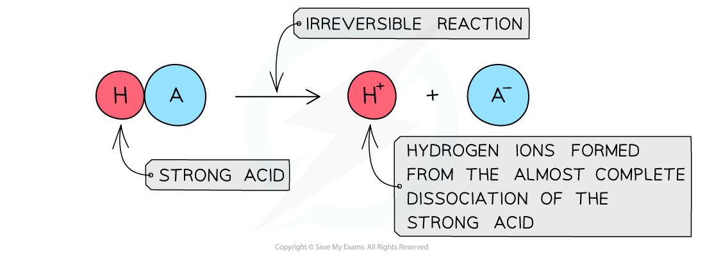

Acid Dissociation
-----------------

#### Strong acids

* A <b>strong acid </b>is an acid that <b>dissociates</b> almost <b>completely</b> in aqueous solutions

  + HCl (hydrochloric acid), HNO3 (nitric acid) and H2SO4 (sulfuric acid)
* The position of the equilibrium is so far over to the <b>right</b> that you can represent the reaction as an irreversible reaction

<i><b>The diagram shows the complete dissociation of a strong acid in aqueous solution</b></i>

#### Weak acids

* A <b>weak acid </b>is an acid that <b>partially</b> (or incompletely) <b>dissociates</b> in aqueous solutions

  + Eg. most organic acids (ethanoic acid), HCN (hydrocyanic acid), H2S (hydrogen sulfide) and H2CO3 (carbonic acid)
* The position of the equilibrium is more over to the <b>left</b> and an equilibrium is established

<i><b>The diagram shows the partial dissociation of a weak acid in aqueous solution</b></i>

#### Enthalpy change of neutralisation

* The enthlapy change of neutralisation of <b>strong acids</b> and <b>strong bases</b> are very similar, around -57 to -58 kJmol-1
* This is because the acids and alkalis are fully ionised and the neutralisation reaction between H+ + OH– occurs to produce water:

  + H+ (aq) + OH– (aq) → H2O (l)
* The other ions are not involved in the reaction, i.e. are spectator ions, so do not affect neutralisation
* As this is the reaction that is occurring in each stong acid-strong alkali reaction, then the enthalpy change of neutralisation will be very similar
* <b>Weak acids</b> and <b>weak alkalis</b> only partially ionise, so energy has to be used to fully ionise them
* This means that the resulting enthalpy change of neutralisation will be less exothermic , i.e. less negative

  + For example, the standard enthalpy change of neturalisation of ethanoic acid with sodium hydroxide is -55.2 kJ mol-1

Ka Expressions
--------------

* For weak acids as there is an equilibrium we can write an equilibrium constant expression for the reaction

* This constant is called the <b>acid dissociation constant</b>, <i>K</i><i>a</i>, and has the units mol dm-3
* Values of <i>K</i><i>a </i>are very small, for example for ethanoic acid <i>K</i><i>a </i>= 1.74 x 10-5 mol dm-3 
* When writing the equilibrium expression for weak acids, the following assumptions are made:

  + The concentration of hydrogen ions due to the ionisation of water is negligible
* The value of <i>K</i><i>a</i> indicates the extent of dissociation

  + The higher the value of <i>K</i><i>a</i> the more dissociated the acid and the stronger it is
  + The lower the value of <i>K</i><i>a</i> the weaker the acid

pH Calculations for Acids
-------------------------

#### Strong acids

* <b>Strong acids</b> are completely <b>ionised </b>in solution

<b>HA (aq) → H</b><b>+</b><b> (aq) + A</b><b>-</b><b> (aq)</b>

* Therefore, the concentration of hydrogen ions, H+, is <b>equal </b>to the concentration of acid, HA
* The number of hydrogen ions formed from the ionisation of water is <b>very small </b>relative to the [H+] due to ionisation of the strong acid and can therefore be <b>neglected</b>
* The <b>total </b>[H+] is therefore the same as the [HA]

#### Worked Example

What is the pH of 0.01 mol dm-3 hydrochloric acid?

<b>Answer</b>

* [HC<i>l</i>] = [H+] = 0.01 mol dm-3

  + pH = - log[H+]
  + pH = - log[0.01] = 2.00

<b>The pH of dibasic acids</b>

* Dibasic or diprotic acids have two replaceable protons and will react in a 1:2 ratio with bases
* Sulfuric acid is an example

<b>   H</b><b>2</b><b>SO</b><b>4</b><b> (aq)  + 2NaOH (aq) → Na</b><b>2</b><b>SO</b><b>4</b><b> (aq) + 2H</b><b>2</b><b>O (l)</b>

* You might think that being a strong acid it is fully ionised so the concentration of the hydrogen is double the concentration of the acid
* This would mean that 0.1 mol dm-3 would be 0.2 mol dm-3 in [H+] and have a pH of 0.69
* However, measurements of the pH of  0.1 mol dm-3 sulfuric acid show that it is actually about pH 0.98, which indicates it is not fully ionised
* The ionisation of sulfuric acid occurs in two steps

<b>H</b><b>2</b><b>SO</b><b>4</b><b> → HSO</b><b>4</b><b>-</b><b> + H</b><b>+</b>

<b>HSO</b><b>4</b><b>-</b><b> ⇌ SO</b><b>4</b><b>2-</b><b> + H</b><b>+</b>

* Although the first step is thought to be fully ionised, the second step is suppressed by the abundance of hydrogen ions from the first step creating an equilibrium
* The result is that the hydrogen ion concentration is less than double the acid concentration

#### Weak acids

The pH of <b>weak acids</b> can be calculated when the following is known: The <b>concentration</b> of the acid The <i><b>K</b></i><i><b>a</b></i> value of the acid From the <i><b>K</b></i><i><b>a </b></i>expression we can see that there are three variables:

* However, the equilibrium concentration of [H+] and [A-] will be the same since one molecule of HA dissociates into one of each ion
* This means you can simplify and re-arrange the expression to

<i><b>K</b></i><i><b>a</b></i><b> x [HA] = [H</b><b>+</b><b>]</b><b>2</b>

<b>[H</b><b>+</b><b>]</b><b>2 </b><b>= </b><i><b>K</b></i><i><b>a</b></i><b> x [HA] </b>

* Taking the square roots of each side

<b>[H</b><b>+</b><b>] = √(</b><i><b>K</b></i><i><b>a</b></i><b> x [HA])</b>

* Then take the negative logs

<b>pH = -log[H</b><b>+</b><b>] = -log√(</b><i><b>K</b></i><i><b>a</b></i><b> x [HA])</b>

#### Worked Example

<b>pH calculations of weak acids</b>

Calculate the pH of 0.100 mol dm-3 ethanoic acid at 298 k with a <i>K</i><i>a</i> value of 1.74 × 10-5 mol dm-3

<b>Answer</b>

Ethanoic acid is a weak acid which ionises as follows:

<b>CH</b><b>3</b><b>COOH (aq) ⇌ H</b><b>+</b><b> (aq) + CH</b><b>3</b><b>COO</b><b>-</b><b> (aq)</b>

<b>Step 1: </b>Write down the equilibrium expression to find <i>K</i><i>a</i>

<b>Step 2: </b>Simplify the expression

The ratio of H+ to CH3COO- ions is 1:1

The concentration of H+ and CH3COO- ions are therefore the same

The expression can be simplified to:

<b>Step 3: </b>Rearrange the expression to find [H+]

<b>Step 4: </b>Substitute the values into the expression to find [H+]

<b>= 1.32 x 10</b><b>-3</b><b> mol dm</b><b>-3</b>

<b>Step 5: </b>Find the pH

<b>pH = -log[H</b><b>+</b><b>]</b>

<b>= -log(1.32 x 10</b><b>-3</b><b>)</b>

<b>= 2.88</b>