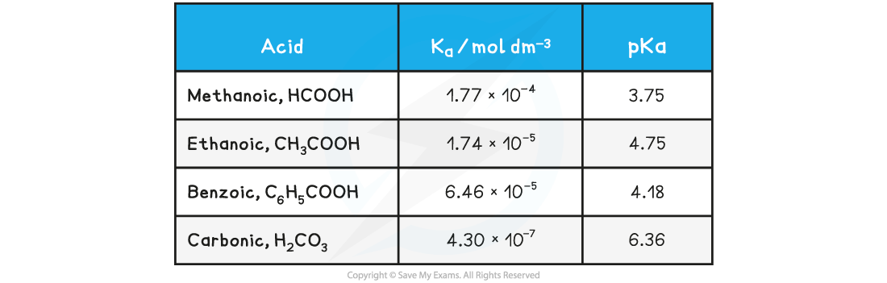

Ionic Product of Water, Kw
--------------------------

* In all aqueous solutions, an equilibrium exists in water where a few water molecules dissociate into protons and hydroxide ions
* We can derive an equilibrium constant for the reaction:

* This is a specific equilibrium constant called the <b>ionic product for water</b>
* The product of the two ion concentrations is <i>always</i> <b>1 x</b> <b>10</b><b>-14 </b><b>mol</b><b>2 </b><b>dm</b><b>-6</b>
* This makes it straightforward to see the relationship between the two concentrations and the nature of the solution:

<b>[H</b><b>+</b><b>] & [OH</b><b>–</b><b>] Table</b>

![[H+] and [OH-] table, downloadable IB Chemistry revision notes](8.1.8-H-and-OH-table.png)

The relationship between <i>K</i><i>w </i>and<i> </i><i>pK</i><i>w</i><i> </i>is given by the following equation:

<b>pK</b><b>w</b><b> = -logK</b><b>w</b>

#### pKa

* The range of values of <i>K</i><i>a</i> is very large and for weak acids, the values themselves are very small numbers

<b>Table of </b><i><b>K</b></i><i><b>a </b></i><b>values</b>

* For this reason it is easier to work with another term called <i><b>pK</b></i><i><b>a</b></i>
* The <i><b>pK</b></i><i><b>a</b></i>  is the negative log of the <i><b>K</b></i><i><b>a</b></i> value, so the concept is analogous to converting [H+] into pH values

<i><b>pK</b></i><i><b>a </b></i><b>= -log</b><i><b>K</b></i><i><b>a</b></i>

* Looking at the <i>pK</i><i>a </i>values for the same acids:

<b>Table of </b><i><b>pK</b></i><i><b>a </b></i><b>values</b>

* The range of <i>pK</i><i>a </i>values for most weak acids lies between 3 and 7

pH Calculation of a Strong Base
-------------------------------

* <b>Strong bases </b>are completely <b>ionised </b>in solution

<b>BOH (aq) → B</b><b>+</b><b> (aq) + OH</b><b>-</b><b> (aq)</b>

* Therefore, the concentration of hydroxide ions [OH-] is <b>equal </b>to the concentration of base [BOH]

  + Even strong alkalis have small amounts of H+ in solution which is due to the ionisation of water
* The concentration of OH- in solution can be used to calculate the pH using the <b>ionic product of water</b>
* Once the [H+] has been determined, the pH of the strong alkali can be founding using pH = -log[H+]

* Similarly, the ionic product of water can be used to find the concentration of OH- ions in solution if [H+] is known, simply by dividing <i>K</i><i>w </i>by the [H+]

#### Worked Example

<b>pH calculations of a strong alkali</b>

<b>Question 1:</b>

Calculate the pH of 0.15 mol dm-3 sodium hydroxide, NaOH

<b>Question 2:</b>

Calculate the hydroxide concentration of a solution of sodium hydroxide when the pH is 10.50

<b>Answer</b>

Sodium hydroxide is a strong base which ionises as follows:

<b>NaOH (aq) → Na</b><b>+</b><b> (aq) + OH</b><b>-</b><b> (aq) </b>

<b>Answer 1:</b>

   The pH of the solution is:

   [H+] = <i>K</i><i>w  </i>÷ [OH-]

   [H+] = (1 x 10-14) ÷ 0.15 = 6.66 x 10-14

   pH = -log[H+]

         = -log 6.66 x 10-14  <b>= 13.17</b>

<b>Answer 2</b>

<b>Step 1:</b> Calculate hydrogen concentration by rearranging the equation for pH

   pH = -log[H+]

   [H+]= 10-pH

   [H+]= 10-10.50

   [H+]= 3.16 x 10-11 mol dm-3

<b>Step 2: </b>Rearrange the <b>ionic product of water</b>  to find the concentration of hydroxide ions

<i>   K</i><i>w</i> = [H+] [OH-]

    [OH-]= <i>K</i><i>w  </i>÷  [H+]

<b>Step 3: </b>Substitute the values into the expression to find the concentration of hydroxide ions

   Since <i>K</i><i>w</i> is 1 x 10-14 mol2 dm-6,

    [OH-]= (1 x 10-14)<i>  </i>÷  (3.16 x 10-11)

   [OH-]=<b> 3.16 x 10</b><b>-4 </b><b>mol dm</b><b>-3</b>