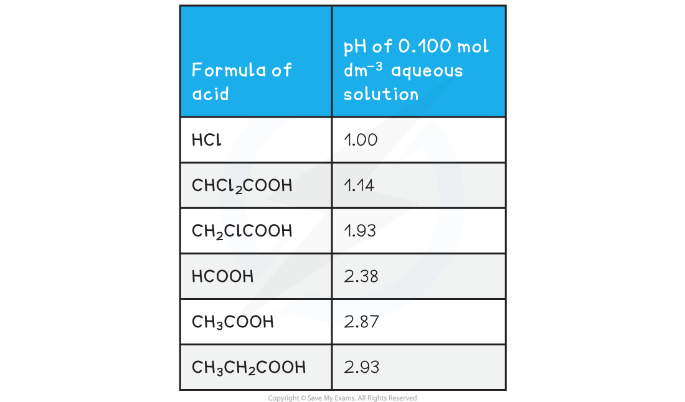
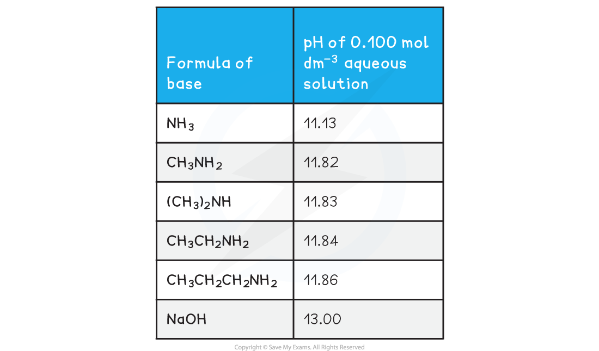
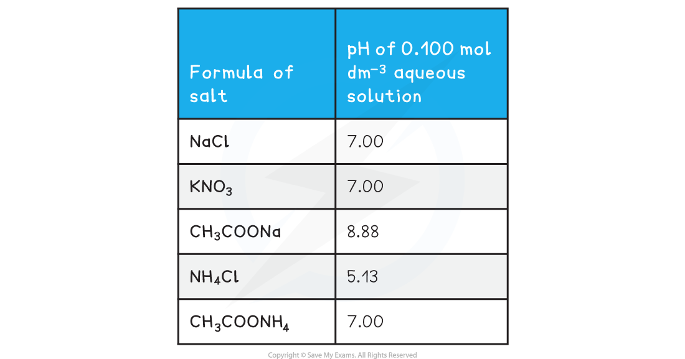
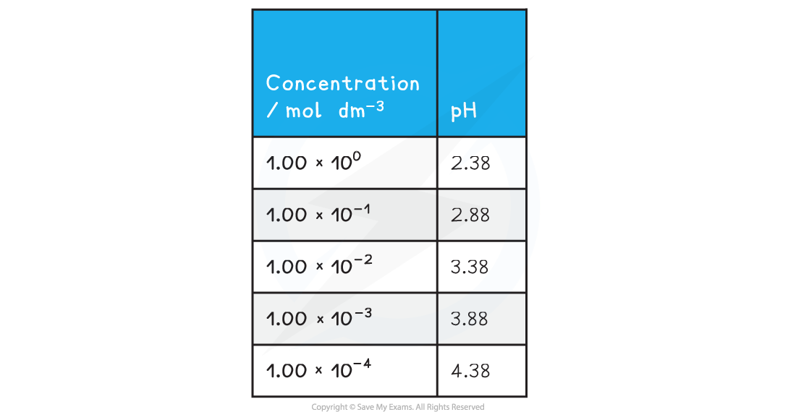

Measuring and Comparing pH
--------------------------

#### Strong and weak acids

* The relative strengths of different acids can be determined by measuring the pH of equimolar aqueous solutions of the acids, at the same temperature

* The higher the value of the pH, the weaker the acid

<b>pH of 0.100 mol dm</b><b>-3</b><b> Aqueous Solutions of Various Acids at 298K</b>

#### Strong and weak bases

<b>pH of 0.100 mol dm</b><b>-3</b><b> Aqueous Solutions of Various Bases at 298K</b>

* The higher the value of the pH, the stronger the base

#### Salts

<b>pH of 0.100 mol dm</b><b>-3</b><b> Aqueous Solutions of Various Salts at 298K</b>

* NaCl and KNO3 both have pH's of 7.00 as they are made from a strong acid and a strong base
* CH3COONa is alkaline as it is made of a weak acid (CH3COOH) and a strong base (NaOH)
* NH4Cl is acidic as it is made of a strong acid (HCl) and a weak base (NH3)
* CH3COONH4 is neutral as it is made from a weak acid (CH3COOH) and a weak base (NH3) which both have similar relative strengths

#### Effect of dilution on the pH of aqueous solutions of acids

<b>Strong acids</b>

* As concentration increases by a factor of 10 the pH decreases by one unit

<b>pH of Aqueous Solutions of Hydrochloric Acid at Different Concentrations at 298K</b>

* Following this logic we would expect a concentration of 1.00 x 10-8 mol dm-3 to have a pH of 8
* This makes no sense as it would mean our acidic solution is alkaline
* However when we have solutions that are this dilute we can no longer ignore the contribution of hydrogen ions from the dissociation of water
* The hydrochloric acid with a concentration of 1.00 x 10-8 mol dm-3 would have a pH close to 7 as the contribution of hydrogen ions from the water is greater than that from the acid

<b>Weak acids</b>

* As concentration increases by a factor of 10 the pH increases by a factor of around 0.5

<b>pH of Aqueous Solutions of Ethanoic Acid at Different Concentrations at 298K</b>

