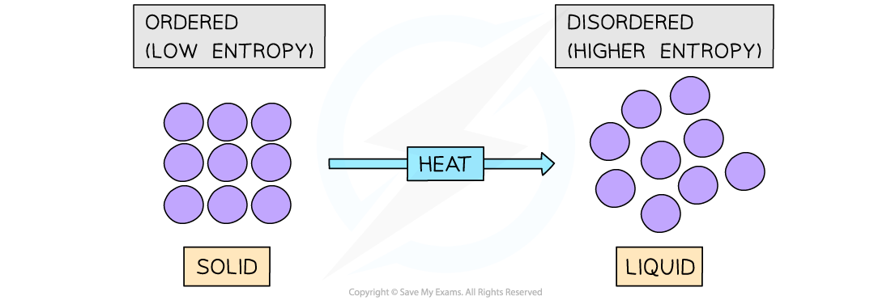

Introducing Entropy
-------------------

* You may have wondered why it is that <b>endothermic</b> reactions occur at all, after all, what can be the driving force behind endothermic reactions if the products end up in a less stable, higher energy state?
* Although the majority of chemical reactions we experience everyday are<b> exothermic</b>,  Δ<i>H</i>ꝋ alone is not enough to explain why endothermic reactions occur

<i><b>The driving force behind chemical reactions cannot be explained by enthalpy changes alone as it makes not sense for chemical to end up in a less stable higher energy state in endothermic reactions</b></i>

* The answer is <b>entropy</b>

#### Chaos in the universe

* The <b>entropy (</b><i><b>S</b></i><b>) </b>of a given system is the number of possible arrangements of the particles and their energy in a given system

  + In other words, it is a measure of how <b>disordered</b> or<b> chaotic</b> a system is
* When a system becomes <b>more disordered</b>, its entropy will <b>increase</b>
* An increase in entropy means that the system becomes <b>energetically more stable</b>

* An example of a system that becomes more disordered is when a solid is <b>melted</b>
* For example, melting ice to form liquid water:

<b>H</b><b>2</b><b>O (s) → H</b><b>2</b><b>O (l)</b>

* The water molecules in ice are in fixed positions and can only vibrate about those positions
* In the liquid state, the particles are still quite close together but are arranged more randomly, in that they can move around each other
* Water molecules in the liquid state are therefore more <b>disordered</b>
* Thus, for a given substance, the <b>entropy</b> <b>increases</b> when its solid form melts into a liquid
* In both examples, the system with the <b>higher</b> <b>entropy</b> will be <b>energetically favourable </b>(as the energy of the system is more spread out when it is in a disordered state)

<i><b>Melting a solid will cause the particles to become more disordered resulting in a higher entropy state</b></i>

Entropy Changes
---------------

#### Production of a gas

* During the thermal decomposition of calcium carbonate (CaCO3) the entropy of the system increases:

<b>CaCO</b><b>3 </b><b>(s) → CaO (s) + CO</b><b>2 </b><b>(g)</b>

* In this decomposition reaction, a gas molecule (CO2) is formed
* The CO2 gas molecule is more disordered than the solid reactant (CaCO3), as it is constantly moving around
* As a result, the system has become more <b>disordered</b> and there is an <b>increase </b>in <b>entropy</b>

* Another example is the reaction of <b>ethanoic acid</b> with <b>ammonium carbonate</b>

<b>(NH</b><b>4</b><b>)</b><b>2</b><b>CO</b><b>3</b><b> (s) + 2CH</b><b>3</b><b>COOH (aq) → 2CH</b><b>3</b><b>COO</b><b>-</b><b> (aq) + 2NH</b><b>4</b><b>+ </b><b>(aq) + CO</b><b>2</b><b> (g) + H</b><b>2</b><b>O (l) </b>

* There is a slight fall in temperature during the reaction indicating the process is endothermic

  + Energy is taken in from the surroundings
* The particles are well-ordered in the solid, and the disorder increases because a solution and, especially, a gas is formed so entropy increases during the reaction

#### Dissolving a solid

* When ammonium nitrate is dissolved in water, the temperature of the solution decreases, therefore the process is endothermic

  + Energy is taken in from the surroundings

<b>NH</b><b>4</b><b>NO</b><b>3</b><b> (s) + aq → NH</b><b>4</b><b>+ </b><b>(aq) + NO</b><b>3</b><b>- </b><b>(aq)    ΔH = 25.7 kJ mol</b><b>-1</b>

* The level of disorder increases as the particles are no longer in a fixed position and are now free to move

* However, it is not always this simple!
* When an <b>ionic </b>solid dissolves

  + Bonds between the particles are broken increasing the disorder and taking in energy
  + Bonds between the solvent and particles are made reducing the disorder and releasing energy
* Therefore it is difficult to predict whether the process will be endothermic or exothermic

#### Endothermic reactions between two solids

* When barium hydroxide and ammonium chloride are mixed, they form a paste and the temperature drops significantly
* Therefore this is an endothermic process

  + Energy is taken in from the surroundings

<b>2NH</b><b>4</b><b>Cl (s) + Ba(OH)</b><b>2</b><b>.8H</b><b>2</b><b>O (s)  → BaCl</b><b>2</b><b>.2H</b><b>2</b><b>O (s) + 2NH</b><b>3</b><b> (g) + 8H</b><b>2</b><b>O (l)</b>

* The gas produced is ammonia and this can be detected by the smell and it will turn damp red litmus paper blue
* When two solids are mixed and react together, the entropy change will depend on the physical state of the compounds made and not just on the energy changes in the reaction
* Two solids will of course have a very low entropy due to the high order
* If a liquid or gas is produced the entropy will have increased due to the increased disorder of the particles