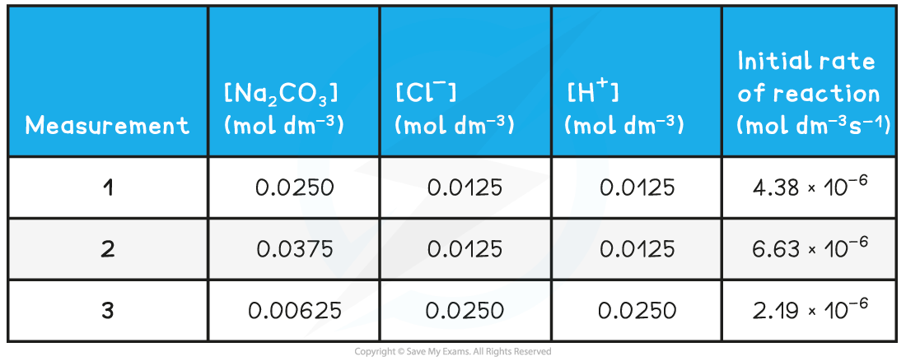

Orders of Reaction
------------------

* The <b>order </b>of a reactant shows how the concentration of a chemical, typically a reactant, affects the rate of reaction
* It is the power to which the concentration of that reactant is raised in the rate equation
* The order can have a positive, negative or fractional value

  + Orders that are a fraction suggest that the reaction involves multiple steps

* When the order of reaction with respect to a chemical is 0

  + Changing the concentration of the chemical has no effect on the rate of the reaction
  + Therefore, it is not included in the rate equation
* When the order of reaction with respect to a chemical is 1

  + The concentration of the chemical is directly proportional to the rate of reaction, e.g. doubling the concentration of the chemical doubles the rate of reaction
  + The chemical is included in the rate equation
* When the order of reaction with respect to a chemical is 2

  + The rate is directly proportional to the square of the concentration of that chemical, e.g. doubling the concentration of the chemical increases the rate of reaction by a factor of four
  + The chemical is included in the rate equation (appearing as a squared term)
* The <b>overall order of reaction</b> is the sum of the powers of the reactants in a rate equation

#### Worked Example

The chemical equation for the thermal decomposition of dinitrogen pentoxide is:

2N2O5 (g)<b> → </b>4NO2 (g) + O2 (g)

The rate equation for this reaction is:

Rate = <i>k</i>[N2O5 (g)]

1. State the order of the reaction with respect to dinitrogen pentoxide
2. Deduce the effect on the rate of reaction if the concentration of dinitrogen pentoxide is tripled

<b>Answers</b>

<b>Answer 1:</b>

* Dinitrogen pentoxide features in the rate equation, therefore, it cannot be order zero / 0

  + The dinitrogen pentoxide is not raised to a power, which means that it cannot be order 2 / second order
  + Therefore, the order with respect to dinitrogen pentoxide must be <b>order 1 / first order</b>

<b>Answer 2:</b>

* Since the reaction is first order, the concentration of dinitrogen pentoxide is directly proportional to the rate

  + This means that if the concentration of the dinitrogen pentoxide is tripled, then the rate of reaction will also <b>triple</b>

#### Worked Example

The following equation represents the oxidation of bromide ions in acidic solution

BrO3- (aq) + 5Br- (aq) + 6H+ (aq) → 3Br2 (l) + 3H2O (l)

The rate equation for this reaction is:

Rate = <i>k</i>[BrO3- (aq)][Br- (aq)][H+ (aq)]

1. State the overall order of the reaction
2. Deduce the effect on the rate of reaction if the concentration of bromate ions is doubled and the concentration of bromide ions is halved

<b>Answers</b>

<b>Answer 1:</b>

* All three reactants feature in the rate equation but they are not raised to a power, this means that the order with respect to each reactant is order 1 / first order.

  + The overall order of the reaction is 1 + 1 + 1 = <b>3</b> or <b>third order</b>.

<b>Answer 2:</b>

* Since each reactant is first order, the concentration of each reactant is directly proportional to the effect that it has on rate

  + If the concentration of the bromate ion is doubled, then the rate of reaction will also double
  + If the concentration of the bromide ion is halved then the rate will also halve
  + Therefore, there is <b>no overall effect</b> on the rate of reaction - one change doubles the rate and the other change halves it

Deriving Rate Equations
-----------------------

* Let's take the following reaction and derive the rate equation from experimental data

<b>(CH</b><b>3</b><b>)</b><b>3</b><b>CBr  +  OH</b><b>-</b><b>  →  (CH</b><b>3</b><b>)</b><b>3</b><b>COH  +  Br</b><b>-</b>

<b>Table to show the experimental data of the above reaction</b>

|  |  |  |  |
| --- | --- | --- | --- |
| <b>Experiment</b> | <b>Initial [(CH</b><b>3</b><b>)</b><b>3</b><b>CBr] / mol dm</b><b>-3</b><b> </b> | <b>Initial [OH</b><b>–</b><b>] / mol dm</b><b>-3</b><b> </b> | <b>Initial rate of reaction / mol dm</b><b>-3</b><b> s</b><b>-1</b> |
| <b>1</b> | 1.0 x 10-3 | 2.0 x 10-3 | 3.0 x 10-3 |
| <b>2</b> | 2.0 x 10-3 | 2.0 x 10-3 | 6.10 x 10-3 |
| <b>3</b> | 1.0 x 10-3 | 4.0 x 10-3 | 1.2 x 10-2 |

* To derive the rate equation for a reaction, you must first determine all of the orders with respect to each of the reactants
* This can be done using a graph, but it doesn't have to be - you can use tabulated data provided
* Take the reactants one at a time and find the order with respect to each reactant individually

* Identify two experiments where the concentration of the reactant you are looking at first changes, but the concentrations of all other reactants remain constant
* Repeat this for all of the reactants, one at a time, until you have determined the order with respect to all reactants

#### Order with respect to [(CH3)3CBr]

* From the above table, that is experiments 1 and 2

  + The [(CH3)3CBr] has doubled, but the [OH-] has remained the same
  + The rate of the reaction has also doubled
  + Therefore, the order with respect to [(CH3)3CBr] is 1 (first order)

#### Order with respect to [OH-]

* From the above table, that is experiments 1 and 3

  + The [OH-] has doubled, but the [(CH3)3CBr] has remained the same
  + The rate of reaction has increased by a factor of 4 (i.e. increased by 22)
  + Therefore, the order with respect to [OH-] is 2 (second order)

#### Putting the rate equation together

* Once you know the order with respect to all of the reactants, you put them together to form the rate equation
* If a reactant has an order of 0, then you do not include it in the rate equation
* If a reactant has an order of 1, then you do not need to include the number 1 as a power
* If a reactant has an order of 2, then you raise that reactant concentration to the power of 2
* For this reaction, the rate equation will be:

<b>Rate = k [(CH</b><b>3</b><b>)</b><b>3</b><b>CBr] [OH</b><b>-</b><b>]</b><b>2</b>

#### Examiner Tips and Tricks

Be careful when reading the values in standard form! It is easy to make a mistake.

* The <b>rate</b> <b>constant</b> (<i>k</i>) of a reaction can be calculated using the initial rates and the rate equation

#### Calculating the rate constant from the initial rate

* The reaction of sodium carbonate with chloride ions (from hydrochloric acid) to form sodium chloride will be used as an example to calculate the rate constant from the <b>initial rate and initial concentrations</b>
* The reaction and rate equation are as follows:

<b>Na</b><b>2</b><b>CO</b><b>3</b><b> (aq) + 2Cl</b><b>-</b><b> (aq) + 2H</b><b>+</b><b> (aq) → 2NaCl (aq) + CO</b><b>2</b><b> (g) + H</b><b>2</b><b>O (l)</b>

* The <b>progress</b> of the reaction can be followed by measuring the <b>initial</b> <b>rates</b> of the reaction using various <b>initial concentrations </b>of each reactant

<b>Experimental results of concentrations & initial rates table</b>

* To find the rate constant (<i>k</i>):
* Substitute the values of one of the experiments to find <i>k</i> (for example <b>measurement 1</b>)

* The values of <b>measurement 2 </b>or <b>3 </b>could also have been used to find <i>k</i>

  + They all give the same result of 1.40 x 10-2

#### Calculating Units

* When you are asked to calculate the rate constant, k, for a reaction you must also be able to deduce the units
* This is done by replacing the values in the rearranged rate equation with the units of that value
* The units can then be combined or cancelled as required
* For example, to calculate the units for the above reaction:

