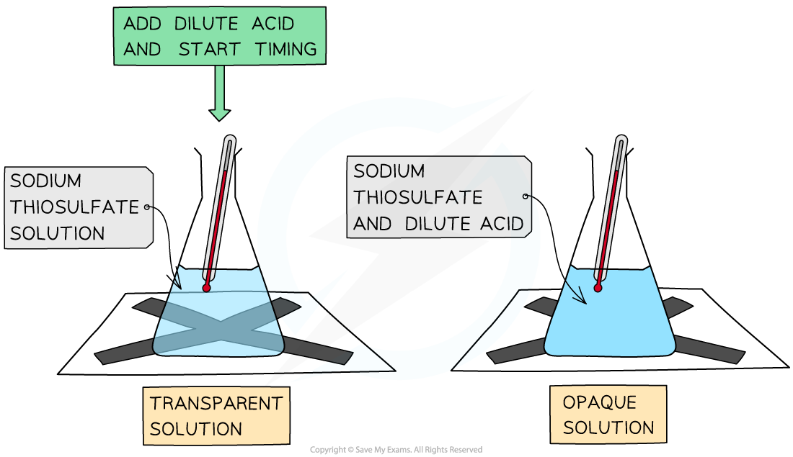

Rates - Experimental Techniques
-------------------------------

* To measure the <b>rate of a reaction</b>, we need to be able to measure either how quickly the reactants are used up or how quickly the products are formed
* The method used for measuring depends on the substances involved
* There are a number of ways to measure a reaction rate in the lab; they all depend on some property that changes during the course of the reaction
* That property is taken to be <b>proportional</b> to the concentration of the reactant or product, e.g., colour, mass, volume
* Some reaction rates can be measured as the reaction proceeds (this generates more data);

  + faster reactions can be easier to measure when the reaction is over, by averaging a collected measurement over the course of the reaction
* Some commonly used techniques are:

  + <b>titration</b>
  + <b>colorimetry</b>
  + <b>mass loss</b>
  + <b>gas production</b>

#### Changes in colour

* A colorimeter measures the amount of light that passes through a solution

<i><b>Colorimetry Set Up</b></i>

* If a solution changes colour during a reaction this can be used to measure the rate
* The intensity of light reaching the detector is measured every few seconds and the data is plotted to show how the concentration of the reactants or products changes with time
* The light intensity is related to the concentration, so the graph represents a graph of concentration of products or reactants against time

<i><b>Sketch graph of colour intensity against time (the coloured species is a reactant in this case)</b></i>

* Note that colorimetry cannot be used to monitor the formation of coloured precipitates as the light will be scattered or blocked by the precipitate

#### Changes in mass

* When a gas is produced in a reaction it usually escapes from the reaction vessel, so the mass decreases

  + This can be used to measure the rate of reaction
  + For example, the reaction of calcium carbonate with hydrochloric acid produces CO2
  + The mass is measured every few seconds and change in mass over time is plotted as the CO2 escapes

<i><b>Measuring changes in mass using a balance</b></i>

* The mass loss provides a measure of the amount of reactant, so the graph is the same as a graph of amount of reactant against time

<i><b>Mass loss of a product against time</b></i>

* However, one limitation of this method is the gas must be sufficiently dense or the change in mass is too small to measure on a 2 or 3 dp balance

  + So carbon dioxide would be suitable (Mr = 44) but hydrogen would not (Mr = 2)

#### Volumes of gases

* When a gas is produced in a reaction, it can be trapped and its volume measured over time

  + This can be used to measure the rate of reaction.
  + For example, the reaction of magnesium with hydrochloric acid produces hydrogen

<i><b>Collecting gases experimental set up</b></i>

* An alternative gas collection set up involves collecting a gas through water using an inverted measuring cylinder ( as long as the gas is not water soluble)

<i><b>Alternative gas collection set up</b></i>

* The volume can be measured every few seconds and plotted to show how the volume of gas varies with time
* The volume provides a measure of the amount of product, so the graph is a graph of amount of product against time

<i><b> Graph of gas volume evolved against time</b></i>

#### Measuring concentration changes

* Measuring concentration changes during a reaction is not easy; the act of taking a sample and analysing it by <b>titration</b> can affect the rate of reaction (unless the reaction is deliberately stopped- this is called <b>quenching</b>).
* Often it is more convenient to ‘stop the clock’ when a specific (visible) point in the reaction is reached

  + For example when a piece of magnesium dissolves completely in hydrochloric acid
  + Another common rate experiment is the reaction between sodium thiosulfate and hydrochloric acid which slowly produces a yellow precipitate of sulfur that obscures a cross when viewed through the solution:

Na2S2O3 (aq) + 2HCl (aq)   →  2NaCl aq) + SO2 (g) + H2O (l) + S(s)

<i><b>The disappearing cross experiment</b></i>

* The main limitation here is that often it only generates one piece of data for analysis

#### Examiner Tips and Tricks

You should be familiar with the interpretation of graphs of changes in concentration, volume or mass against time and be able to calculate a rate from a tangent to the graph