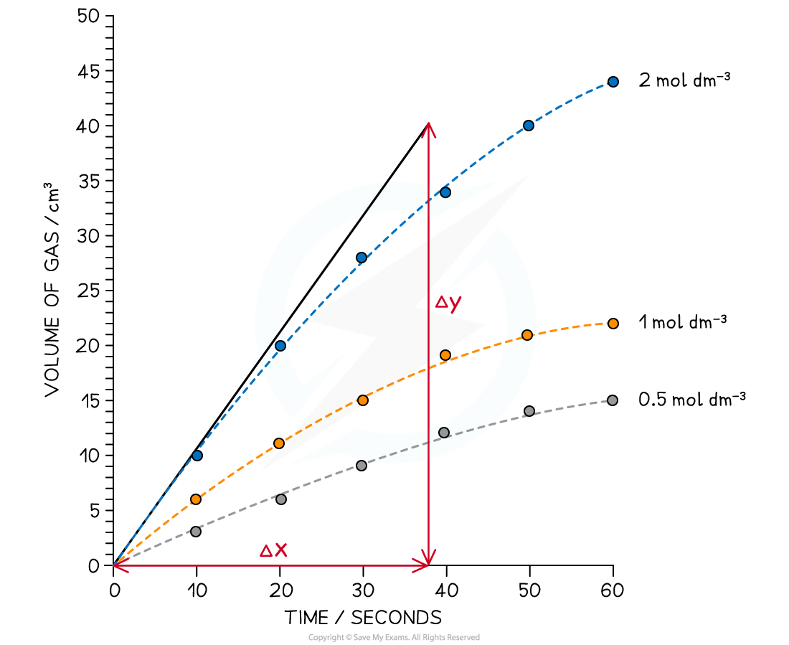
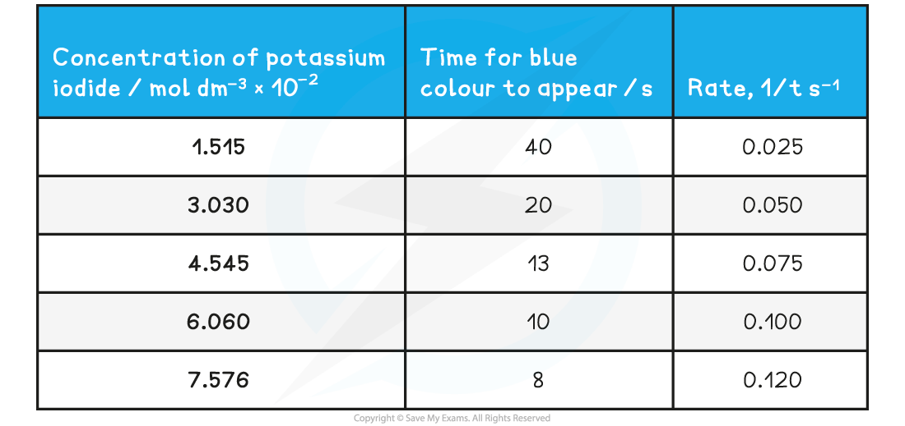

Initial Rates Methods
---------------------

* The <b>initial rates method</b> determines the rate at the very start of the reaction when <i>t</i> = 0
* The initial rate can be found by:

  + Drawing a <b>concentration-time graph</b>
  + Adding a <b>tangent </b>at <i>t</i> = 0
  + Calculating the <b>gradient </b>of the tangent
* One example of measuring the initial rate could be the reaction of calcium carbonate with hydrochloric acid

  + The volume of carbon dioxide produced with different concentrations can be measured against time
  + The results are then plotted onto a graph
  + The tangent at <i>t</i> = 0 is then added
  + The gradient of the tangent can then be calculated to give the initial rate of the reaction

#### Worked Example

The concentration-time graph for the reaction of calcium carbonate with three different concentrations of hydrochloric acid is shown

Calculate the initial rate of reaction for the reaction of calcium carbonate with 2.0 mol dm-3 hydrochloric acid

<b>Answer</b>

* Using the tangent drawn:

  + Gradient <math><semantics><mrow><mo>=</mo><mo> </mo><mfrac><mrow><mi>Δ</mi><mi>y</mi></mrow><mrow><mi>Δ</mi><mi>x</mi></mrow></mfrac><mo> </mo><mo>=</mo><mo> </mo><mfrac><mn>40</mn><mn>38</mn></mfrac><mo> </mo><mo>=</mo></mrow><annotation>{"language":"en","fontFamily":"Times New Roman","fontSize":"18"}</annotation></semantics></math>1.05 mol dm-3 s-1
  + Therefore, the initial rate of reaction is 1.05 mol dm-3 s-1

#### Clock reactions

* <b>Clock reactions </b>are a more convenient way of measuring the initial rate of reaction using a <b>single measurement</b>
* The time taken, <i>t</i>, for a specific visual change in the reaction to occur is measured

  + These changes could be a colour change or formation of a precipitate
* The major assumption that clock reactions depend on is:

  + That there is no significant change in the rate of reaction between the start of the reaction and the time when the measurement is taken
* The initial rate is then proportional to <math><semantics><mfrac><mn>1</mn><mi>t</mi></mfrac><annotation>{"language":"en","fontFamily":"Times New Roman","fontSize":"18"}</annotation></semantics></math>

* The iodine clock experiment is a common clock reaction

  + This is covered in more detail in the PAG notes
* Here is a set of typical results for the iodine clock reaction:

<b>Specimen results for the iodine clock reaction table</b>

* The initial rate is a relatively simple calculation

  + E.g. For a concentration of 0.01515 mol dm-3, the rate is <math><semantics><mfrac><mn>1</mn><mn>40</mn></mfrac><annotation>{"language":"en","fontFamily":"Times New Roman","fontSize":"18"}</annotation></semantics></math> = 0.025 s-1
* A closer look at the results shows that as the concentration doubles, the rate also doubles

  + This can be linked back to the reaction being first order

* There are limitations to the accuracy of the clock reaction

  + These are, again, based on the assumption that the rate of reaction is constant
* As the reaction progresses, the concentration of the reactants decreases - typically on a curve

  + Therefore, when the time measured for the reaction to occur is short then there is a higher chance that the initial rate calculated will be closer to the true value
  + As the time taken for the reaction to occur, the value of the initial rate will become less accurate
* The initial rate measured during a clock reaction is an estimate

#### Examiner Tips and Tricks

* You can be expected to work with experimental data to deduce the order of reaction with respect to specific reactants
* This is done in the same that has been previously discussed in 5.5.2 Rate Equations