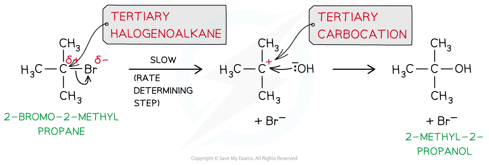

Deducing Reaction Mechanisms
----------------------------

* Chemical kinetics can only <b>suggest</b> a reaction mechanism, they cannot prove it

  + However, they can be used to disprove a proposed mechanism
* Elementary steps are the steps involved in a reaction mechanism

  + For example, in the following general reaction:

<b>A + B → C + D</b>

* The elementary steps could involve the formation of an intermediate:

<b>Elementary step 1: A → R + D</b>

<b>Elementary step 2: R + B → C</b>

* It is important that the elementary steps for a proposed mechanism agree with the overall stoichiometric equation

  + For example, combining the 2 elementary steps above gives the overall stoichiometric equation

<b>A + R + B → R + C + D</b>

<b>A + B → C + D</b>

#### Worked Example

Sulfur dioxide reacts with oxygen to form sulfur trioxide

1. Propose a one step mechanism for the above reaction
2. The above reaction is catalysed by the formation of nitrogen dioxide from nitrogen monoxide. Propose a two step mechanism for this reaction.

<b>Answers</b>

<b>Answer 1:</b>

* A one step reaction mechanism is simply the overall stoichiometric equation

  + Therefore, the correct answer is 2SO2 + O2 → 2SO3

<b>Answer 2:</b>

* One of the two elementary steps for this two step mechanism can be taken from the question:

Elementary step 1: 2NO + O2 → 2NO2

* The second elementary step must involve the reaction of the nitrogen dioxide formed with sulfur dioxide:

Elementary step 2: NO2 + SO2 → NO + SO3 (or 2NO2 + 2SO2 → 2NO + 2SO3)

#### Examiner Tips and Tricks

It is important that you check that the equations you are proposing for a reaction mechanism.They <b>must</b> add up to the overall stoichiometric equation, otherwise the proposed mechanism is wrong.

#### Predicting the reaction mechanism

* The overall reaction equation and rate equation can be used to predict a possible reaction mechanism of a reaction

  + This shows the individual reaction steps which are taking place
* For example, nitrogen dioxide (NO2) and carbon monoxide (CO) react to form nitrogen monoxide (NO) and carbon dioxide (CO2)

  + The overall reaction equation is:

<b>NO</b><b>2</b><b> (g) + CO (g) → NO (g) + CO</b><b>2</b><b> (g)</b>

* The rate equation is:

<b>Rate = </b><i><b>k</b></i><b> [NO</b><b>2</b><b>]</b><b>2</b>

* From the rate equation, it can be concluded that the reaction is zero-order with respect to CO (g) and second-order with respect to NO2 (g)
* This means that there are two molecules of NO2 (g) involved in the rate-determining step and zero molecules of CO (g)

  + This means that in terms of molecularity, the rate determining step is bimolecular
* A possible reaction mechanism could therefore be:

<b>Step 1:</b>

<b>   2NO</b><b>2</b><b> (g) → NO (g) + NO</b><b>3</b><b> (g)</b>                   <b>slow </b>(rate-determining step)

<b>Step 2:</b>

<b>   NO</b><b>3</b><b> (g) + CO (g) → NO</b><b>2</b><b> (g) + CO</b><b>2</b><b> (g)</b>     <b>fast</b>

<b>Overall:</b>

<s><b> 2</b></s><b>NO</b><b>2</b><b> (g) + </b><s><b>NO</b></s><s><b>3</b></s><s><b> (g)</b></s><b> + CO (g) → NO (g) + </b><s><b>NO</b></s><s><b>3</b></s><s><b> (g)</b></s><b> + </b><s><b>NO</b></s><s><b>2</b></s><s><b> (g) </b></s><b>+ CO</b><b>2</b><b> (g)</b>

<b>   =     NO</b><b>2</b><b> (g) + CO (g) → NO (g) + CO</b><b>2</b><b> (g)</b>

#### Examiner Tips and Tricks

It is important that the elementary steps for a proposed mechanism also agree with the experimentally determined rate equationThe rate equation and the overall reaction must be related, i.e. the correct chemical species involved<b>Remember:</b> There is no direct link between the orders in the rate equation and the stoichiometry of the overall equationHowever, the rate equation can be derived directly from the rate determining step and its stoichiometry

#### Predicting the reaction order & deducing the rate equation

* The <b>order</b> of a reactant and thus the rate equation can be deduced from a reaction mechanism if the rate-determining step is known
* For example, the reaction of nitrogen oxide (NO) with hydrogen (H2) to form nitrogen (N2) and water

<b>2NO (g) + 2H</b><b>2</b><b> (g) → N</b><b>2</b><b> (g) + 2H</b><b>2</b><b>O (l)</b>

* The reaction mechanism for this reaction is:

<b>Step 1:</b>

<b>   NO (g) + NO (g) → N</b><b>2</b><b>O</b><b>2 </b><b>(g)</b>                      <b>fast</b>

<b>Step 2:</b>

<b>   N</b><b>2</b><b>O</b><b>2</b><b> (g) + H</b><b>2</b><b> (g) → H</b><b>2</b><b>O (l) + N</b><b>2</b><b>O (g) </b>    <b>slow </b>(rate-determining step)

<b>Step 3:</b>

<b>   N</b><b>2</b><b>O (g) + H</b><b>2</b><b> (g) → N</b><b>2</b><b> (g) + H</b><b>2</b><b>O (l)           fast</b>

* The second step in this reaction mechanism is the <b>rate-determining step</b>
* The rate-determining step consists of:

  + N2O2 which is formed from the reaction of <b>two NO molecules</b>
  + <b>One H</b><b>2</b><b> molecule</b>
* The reaction is, therefore, <b>second order </b>with respect to NO and <b>first order </b>with respect to H2
* So, the <b>rate</b> <b>equation</b> becomes:

<b>Rate = </b><i><b>k</b></i><b> [NO]</b><b>2</b><b> [H</b><b>2</b><b>]</b>

* The reaction is, therefore, <b>third order overall</b>

#### Examiner Tips and Tricks

Intermediates in the mechanism <b>cannot</b> appear as substances in the rate equationThis is why you substitute the N2O2 in the above example. Step 1 shows that 2NO molecules are required to form the necessary N2O2

SN1 & SN2 Mechanisms
--------------------

* Nucleophilic substitution reactions can occur in two different ways (known as <b>S</b><b>N</b><b>2</b> and <b>S</b><b>N</b><b>1 </b>reactions) depending on the structure of the halogenoalkane involved

#### SN1 reactions

* In<b> tertiary </b>halogenoalkanes, the carbon that is attached to the halogen is also bonded to three alkyl groups
* These halogenoalkanes undergo nucleophilic substitution by an <b>S</b><b>N</b><b>1</b> mechanism

  + ‘S’ stands for ‘substitution’
  + ‘N’ stands for ‘nucleophilic’
  + ‘1’ means that the rate of the reaction (which is determined by the slowest step of the reaction) depends on the concentration of only one reagent, the halogenoalkane

* The SN1 mechanism is a <b>two-step</b> reaction
* In the first step, the C-X bond breaks heterolytically and the halogen leaves the halogenoalkane as an X- ion (this is the <b>slow</b> and <b>rate-determining step</b>)

  + As the rate-determining step only depends on the concentration of the halogenoalkane, the rate equation for an SN1 reaction is <b>rate = </b><i><b>k</b></i><b>[halogenoalkane]</b>
  + An SN1 reaction is described as unimolecular because there is only molecule involved in the rate-determining step
  + This forms a tertiary carbocation <b>(which is a tertiary carbon atom with a positive charge)</b>
  + In the second step, the tertiary carbocation is attacked by the nucleophile

* For example, the nucleophilic substitution of 2-bromo-2-methylpropane by hydroxide ions to form 2-methyl-2-propanol

<i><b>The mechanism of nucleophilic substitution in 2-bromo-2-methylpropane which is a tertiary halogenoalkane</b></i>

#### SN2 reactions

* In<b> primary </b>halogenoalkanes<b>, </b>the carbon that is attached to the halogen is bonded to one alkyl group
* These halogenoalkanes undergo nucleophilic substitution by an <b>S</b><b>N</b><b>2</b> mechanism

  + ‘S’ stands for ‘substitution’
  + ‘N’ stands for ‘nucleophilic’
  + ‘2’ means that the rate of the reaction (which is determined by the slowest step of the reaction) depends on the concentration of both the halogenoalkane and the nucleophile ions

* The SN2 mechanism is a <b>one-step</b> reaction

  + The nucleophile donates a pair of electrons to the δ+ carbon atom of the halogenoalkane to form a new bond

    - As this is a one-step reaction, the rate-determining step depends on the concentrations of the halogenoalkane and nucleophile, the rate equation for an SN2 reaction is <b>rate = </b><i><b>k</b></i><b>[halogenoalkane][nucleophile]</b>
    - An SN2 reaction is bimolecular as there are two molecules involved in the rate-determining step
  + At the same time, the C-X bond is breaking and the halogen (X) takes both electrons in the bond
  + The halogen leaves the halogenoalkane as an X- ion
* For example, the nucleophilic substitution of bromoethane by hydroxide ions to form ethanol

<i><b>The </b></i><b>S</b><b>N</b><b>2 </b><i><b>mechanism of bromoethane with hydroxide causing an inversion of configuration</b></i>

#### Examiner Tips and Tricks

Primary halogenoalkanes only react via with SN2 mechanism

Secondary halogenoalkanes react via both the SN1 and SN2 mechanisms

Tertiary halogenoalkanes only react via with SN1 mechanism