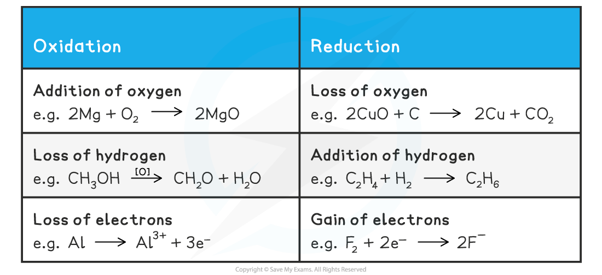

Reduction & Oxidation
---------------------

* To recap, there are three definitions of <b>oxidation</b> and <b>reduction</b>  used in different branches of chemistry
* <b>Oxidation</b> and <b>reduction</b> can be used to describe any of the following processes

<b>Definitions and Examples of Oxidation & Reduction</b>

<i><b>Use the acronym "Oil Rig" to help you remember the definitions of oxidation and reduction</b></i>

* s-block elements are usually oxidised by losing electrons to form 1+ and 2+ ions

Na → Na+ + e–

Ca → Ca2+ + 2e–

* p-block metals typically undergo oxidation, by losing electrons, to form positive ions

  + p-block metal ions can have a charge that is consistent with their group of the Periodic Table

Al → Al3+ + 3e–

* p-block metal ions can also form common ions with a charge that is not consistent with their group

Sn → Sn2+ + 2e–

* p-block non-metals are usually reduced, by gaining electrons, to form negative ions

  + p-block non-metals form ions with a charge that can be calculated by (the group number - 8)

F + e- → F– (group 7 - 8 = -1)

O + 2e– → O2- (group 6 - 8 = -2)

* d-block elements can form various ions due to their variable oxidation states

  + d-block elements will usually be oxidised, by losing electrons, to form positive ions, e.g. Cu2+, Cr3+, V5+