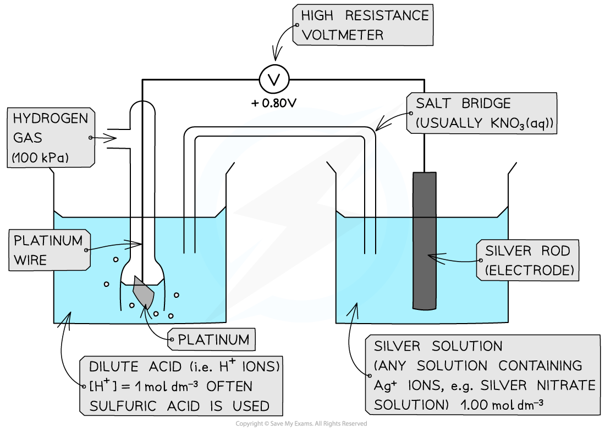
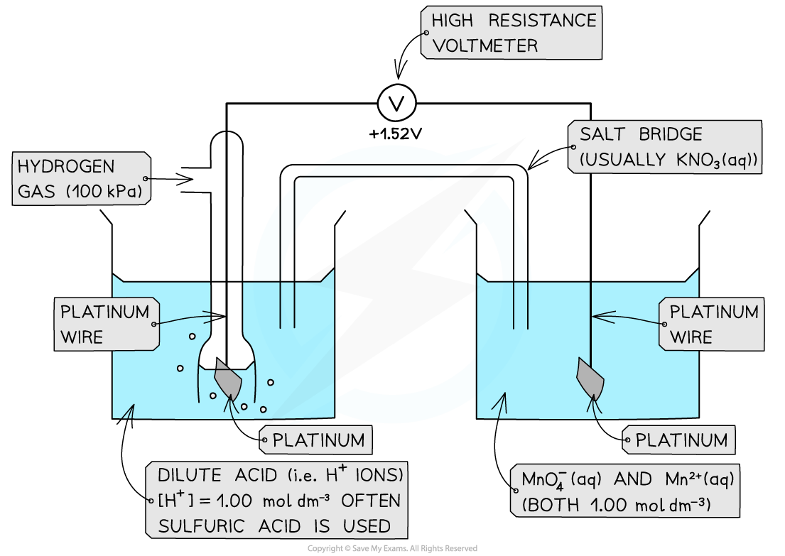
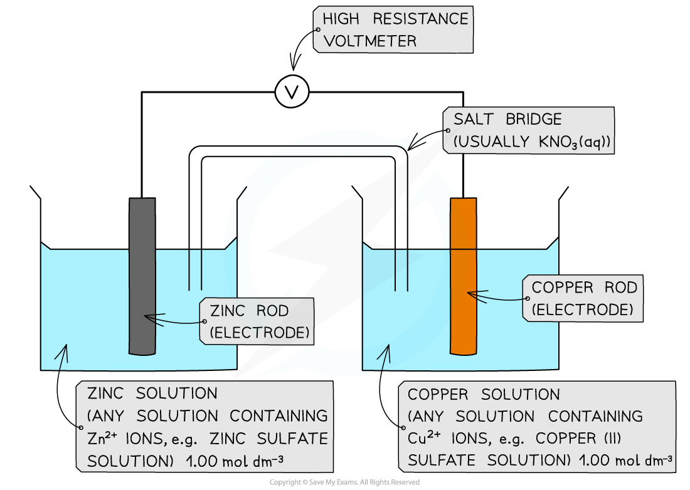

Measuring Standard Electrode Potential
--------------------------------------

* There are three different types of half-cells that can be connected to a standard hydrogen electrode to measure standard electrode potential

  + A metal / metal ion half-cell
  + A non-metal / non-metal ion half-cell
  + An ion / ion half-cell (the ions are in different oxidation states)

#### Metal / metal-ion half-cell

<i><b>Example of a metal / metal ion half-cell connected to a standard hydrogen electrode</b></i>

* An example of a metal/metal ion half-cell is the Ag+/ Ag half-cell

  + Ag is the metal
  + Ag+ is the metal ion
* This half-cell is connected to a <b>standard hydrogen electrode</b> and the two half-equations are:

<b>Ag</b><b>+</b><b> (aq) + e</b><b>- </b><b>⇌ Ag (s)        </b><i><b>E</b></i><b>ꝋ </b><b>= + 0.80 V</b>

<b>2H</b><b>+</b><b> (aq) + 2e</b><b>- </b><b>⇌ H</b><b>2</b><b> (g)        </b><i><b>E</b></i><b>ꝋ </b><b>= 0.00 V </b>

* Since the Ag+/ Ag half-cell has a more positive <i>E</i>ꝋ value, this is the <b>positive pole </b>and the H+/H2 half-cell is the <b>negative</b> pole
* The <b>standard cell potential (</b><i>E</i><i>cell</i>ꝋ) is <i><b>E</b></i><i><b>cell</b></i><b>ꝋ</b><b> = (+ 0.80) - (0.00) = + 0.80 V</b>
* The Ag+ ions are more likely to get <b>reduced </b>than the H+ ions as it has a greater <i>E</i>ꝋ value

  + Reduction occurs at the <b>positive electrode</b>
  + Oxidation occurs at the <b>negative electrode</b>

#### Non-metal / non-metal ion half-cell

* In a <b>non-metal / non-metal ion </b>half-cell, <b>platinum </b>wire or foil is used as an electrode to make electrical contact with the solution

  + Like graphite, platinum is inert and does not take part in the reaction
  + The redox equilibrium is established on the platinum surface
* An example of a non-metal / non-metal ion is the Br2 / Br- half-cell

  + Br2 is the non-metal
  + Br- is the non-metal ion
* The half-cell is connected to a <b>standard hydrogen electrode</b> and the two half-equations are:

<b>Br</b><b>2</b><b> (aq) + 2e</b><b>- </b><b>⇌ 2Br</b><b>-</b><b> (aq)        </b><i><b>E</b></i><b>ꝋ</b><b> = +1.09 V</b>

<b>2H</b><b>+</b><b> (aq) + 2e</b><b>- </b><b>⇌ H</b><b>2</b><b> (g)        </b><i><b>E</b></i><b>ꝋ</b><b> = 0.00 V   </b>

* The Br2 / Br- half-cell is the <b>positive pole</b> and the H+ / H2 is the <b>negative</b> pole
* The <i>E</i><i>cell</i>ꝋ is: <i><b>E</b></i><i><b>cell</b></i><b>ꝋ</b><b> = (+ 1.09) - (0.00) = + 1.09 V</b>
* The Br2 molecules are more likely to get <b>reduced </b>than H+ as they have a greater <i>E</i>ꝋ value

<i><b>Example of a non-metal / non-metal ion half-cell connected to a standard hydrogen electrode</b></i>

#### Ion / Ion half-cell

* A <b>platinum electrode </b>is again used to form a half-cell of ions that are in <b>different oxidation states</b>
* An example of such a half-cell is the MnO4- / Mn2+ half-cell

  + MnO4- is an ion containing Mn with oxidation state +7
  + The Mn2+ ion contains Mn with oxidation state +2
* This half-cell is connected to a <b>standard hydrogen electrode</b> and the two half-equations are:

<b>MnO</b><b>4</b><b>-</b><b> (aq) + 8H</b><b>+</b><b> (aq) + 5e</b><b>- </b><b>⇌ Mn</b><b>2+</b><b> (aq) + 4H</b><b>2</b><b>O (l)       </b><i><b>E</b></i><b>ꝋ</b><b> = +1.52 V</b>

<b>2H</b><b>+</b><b> (aq) + 2e</b><b>- </b><b>⇌ H</b><b>2</b><b> (g)       </b><i><b>E</b></i><b>ꝋ </b><b>= 0.00 V   </b>

* The H+ ions are also present in the half-cell as they are required to convert MnO4- into Mn2+ ions
* The MnO4- / Mn2+ half-cell is the <b>positive pole</b> and the H+ / H2 is the <b>negative</b> pole
* The <i>E</i><i>cell</i>ꝋ is <i><b>E</b></i><i><b>cell</b></i><b>ꝋ</b><b> = (+ 1.52) - (0.00) = + 1.52 V</b>

<i><b>Ions in solution half cell</b></i>

#### The Salt Bridge

* A salt bridge has <b>mobile ions</b> that complete the circuit
* Ions must be able to flow between the half-cells or solutions
* This should be made on metal wire, even if the metal is inert

  + Metal wire allows the flow of electrons but not the flow of ions
* <b>Potassium chloride</b> and <b>potassium nitrate</b> are commonly used to make the salt bridge as chlorides and nitrates are usually soluble
* This should ensure that no precipitates form which can affect the equilibrium position of the half cells

Electromotive Force
-------------------

#### Standard cell potential

* Once the <i><b>E</b></i>ꝋ of a half-cell is known, the <b>potential difference</b> or <b>voltage</b> or<b> emf</b> of an <b>electrochemical cell </b>made up of any two half-cells can be calculated

  + These could be <b>any</b> half-cells and neither have to be a standard hydrogen electrode
* The <b>standard cell potential (</b><i>E</i><i>cell</i>ꝋ) can be calculated by <b>subtracting </b>the <b>less</b> <b>positive</b> <i>E</i>ꝋ from the <b>more positive </b><i>E</i>ꝋ value

  + The half-cell with the more positive <i>E</i>ꝋ value will be the <b>positive</b> pole

    - By convention this is shown on the right hand side in a conventional cell diagram, so is termed <b> </b><i><b>E</b></i><i><b>right</b></i><b>ꝋ</b>
  + The half-cell with the less positive <i>E</i>ꝋ value will be the <b>negative </b>pole

    - By convention this is shown on the left hand side in a conventional cell diagram, so is termed <b> </b><i><b>E</b></i><i><b>left</b></i><b>ꝋ</b>

<i><b>E</b></i><i><b>cell</b></i><b>ꝋ</b><b> = </b><i><b>E</b></i><i><b>right</b></i><b>ꝋ </b><b>- </b><i><b>E</b></i><i><b>left</b></i><b>ꝋ   </b>

* Since oxidation is always on the left and reduction on the right, you can also use this version

<i><b>E</b></i><i><b>cell</b></i><b>ꝋ</b><b> = </b><i><b>E</b></i><i><b>reduction</b></i><b>ꝋ </b><b>- </b><i><b>E</b></i><i><b>oxidation</b></i>

#### Worked Example

<b>Calculating the standard cell potential</b>

Calculate the standard cell potential for the electrochemical cell below and explain why the Cu2+ / Cu half-cell is the positive pole. The half-equations are as follows:

Cu2+(aq) + 2e- ⇌ Cu(s)      <i>E</i>ꝋ = +0.34 V

Zn2+(aq) + 2e- ⇌ Zn(s)      <i>E</i>ꝋ = −0.76 V

<b>Answer</b>

<b>Step 1: </b>Calculate the standard cell potential. The copper is more positive so must be the right hand side.

<i>E</i><i>cell</i>ꝋ = <i>E</i><i>right</i>ꝋ - <i>E</i><i>left</i>ꝋ   

<i>E</i><i>cell</i>ꝋ = (+0.34) - (-0.76)

= +1.10 V

The voltmeter will therefore give a value of +1.10 V

<b>Step 2: </b>Determine the positive and negative poles

The Cu2+ / Cu  half-cell is the <b>positive</b> pole as its <i>E</i>ꝋ is more positive than the <i>E</i>ꝋ value of the Zn2+ / Zn half-cell

#### Examiner Tips and Tricks

<b>A helpful mnemonic for remembering redox in cells</b>

<i><b>Lio the lion goes Roor! </b></i>

Lio stands for 'Left Is Oxidation' and he is saying ROOR because that is the order of species in the cell:

Reduced/Oxidised (salt bridge) Oxidised/Reduced