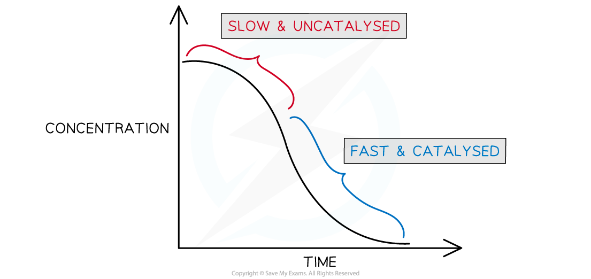
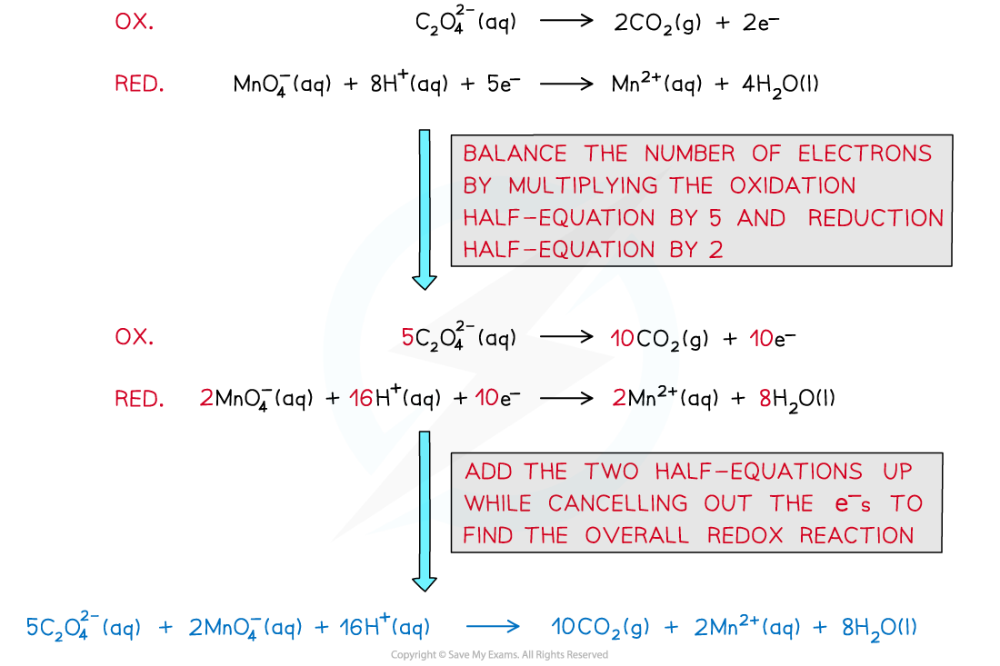

Manganese(II) ions as an Autocatalyst
-------------------------------------

* Autocatalysis the term used to describe a reaction which is speeded up by a product which acts as a catalyst for the reaction
* If you plot a rate graph of concentration versus time it has an usual shape

<i><b>Concentration versus time for an autocatalytic reaction</b></i>

* The gradient becomes steeper during the course of the reaction which tells you the rate is speeding up, not slowing down over time as the reactants become used up
* An example of an autocatalysed reaction takes place between <b>manganate(VII)</b> ions and <b>oxalate</b> (ethandioate) ions
* The overall equation can be deduced from the half equations

* You can see that one of the products is manganese(II) ions - this is the catalyst
* As more manganese(II) is formed the reaction speeds up
* Like to the role of iron(II) in the previous section, manganese(II) ions take part in a redox cycle between two different oxidation states (+2 <b>→  </b>+3 <b>→ </b>+2)

<b>4Mn</b><b>2+ </b><b>(aq) </b><b> </b><b>+  MnO</b><b>4</b><b>–</b><b> (aq) + 8H</b><b>+ </b><b>(aq)   →   5Mn</b><b>3+ </b><b>(aq)  + 4H</b><b>2</b><b>O (aq)</b>

<b>2Mn</b><b>3+ </b><b>(aq) </b><b> </b><b>+  C</b><b>2</b><b>O</b><b>4</b><b>2-</b><b> (aq)  →  2CO</b><b>2</b><b> (g) +  2Mn</b><b>2+ </b><b>(aq)</b>

* The manganese(II) is not present in the beginning of the reaction, but as it is formed is speeds up the reaction and is re-generated during the redox cycle
* This reaction is easily followed on a colorimeter as the rate at which the purple manganate(VII) ion is consumed accelerates with time