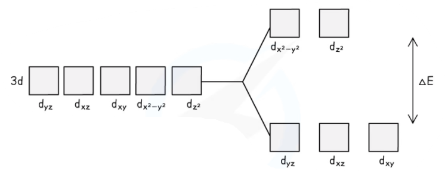

Coloured Ions
-------------

#### Perception of colour

* Most transition metal compounds appear coloured. This is because they absorb energy corresponding to certain parts of the visible <b>electromagnetic spectrum</b>
* The colour that is seen is made up of the parts of the visible spectrum that aren’t absorbed
* For example, a green compound will absorb all frequencies of the spectrum apart from green light, which is transmitted
* The colours absorbed are <b>complementary</b> to the colour observed

<i><b>The colour wheel showing complementary colours in the visible light region of the electromagnetic spectrum</b></i>

* Complementary colours are any two colours which are directly opposite each other in the colour wheel

  + For example, the complementary colour of red is green and the complementary colours of red-violet are yellow-green

#### Splitting of 3d energy levels

* In a transition metal atom, the five orbitals that make up the d-subshell all have the same energy.
* Ions that have completely filled 3d energy levels (such as Zn2+) and ions that have no electrons in their 3d subshells (such as Sc3+) are not coloured
* Transition metals have a partially filled 3d energy level
* When ligands attach to the central metal ion the energy level splits into two levels with slightly different energies

  + If one of the electrons in the lower energy level absorbs energy from the visible spectrum it can move to the higher energy level
  + This process is known as <b>promotion / excitation</b>
* The amount of energy absorbed depends on the difference between the energy levels

  + A larger energy difference means the electron absorbs more energy
* The amount of energy gained by the electron is directly proportional to the frequency of the absorbed light and inversely proportional to the wavelength

<i><b>Upon bonding to ligands, the d orbitals of the transition element ion split into sets of orbitals with different energies</b></i>

Changes in Colour
-----------------

The size of the splitting energy Δ<i>E</i> in the d-orbitals is influenced by the following four factors:

* <b>The size and type of ligands</b>
* <b>The nuclear charge and identity of the metal ion</b>
* <b>The oxidation state of the metal</b>
* <b>The shape of the complex</b>

<i><b>The large variety of coloured compounds is a defining characteristic of transition metals</b></i>

#### Size and type of ligand

* The nature of the ligand influences the strength of the interaction between ligand and central metal ion
* Ligands vary in their charge density
* The greater the charge density; the more strongly the ligand interacts with the metal ion causing greater splitting of the d-orbitals
* The greater the splitting, the more energy is needed to promote an electron to the higher group of orbitals
* Therefore, the further it is shifted towards the region of the spectrum where it absorbs higher energy

  + As splitting increases, the light absorbed will shift away from the red end of the spectrum (longer wavelengths), towards the yellow end (shorter wavelengths)

* As a result, a different colour of light is absorbed by the complex solution and a different <b>complementary colour</b> is observed
* This means that complexes with the same <b>transition elements</b> <b>ions,</b> but <b>different</b> <b>ligands, </b>can have different colours

  + For example, the [Cu(H2O)6]2+ complex has a <b>light blue</b> colour
  + Whereas the [Cu(NH3)4(H2O)2]2+ has a <b>dark blue</b> colour despite the copper(II) ion having an oxidation state of +2 in both complexes

<i><b>Ligand exchange of the water ligands by ammonia ligands causes a change in colour of the copper(II) complex solution</b></i>

#### Oxidation number

* When the same metal has a higher oxidation number that will also create a stronger interaction with the ligands
* If you compare iron(II) and iron (III):

  + [Fe(H2O)6]2+ absorbs in the red region and appears green
  + But, [Fe(H2O)6]3+ absorbs in blue region and appears orange

#### Coordination number

* The change of colour in a complex is also partly due to the change in coordination number and geometry of the complex ion
* The splitting energy, Δ<i>E</i>, of the d-orbitals is affected by the relative orientation of the ligand as well as the d-orbitals
* Changing the coordination number generally involves changing the ligand as well, so it is a combination of these factors that alters the strength of the interactions