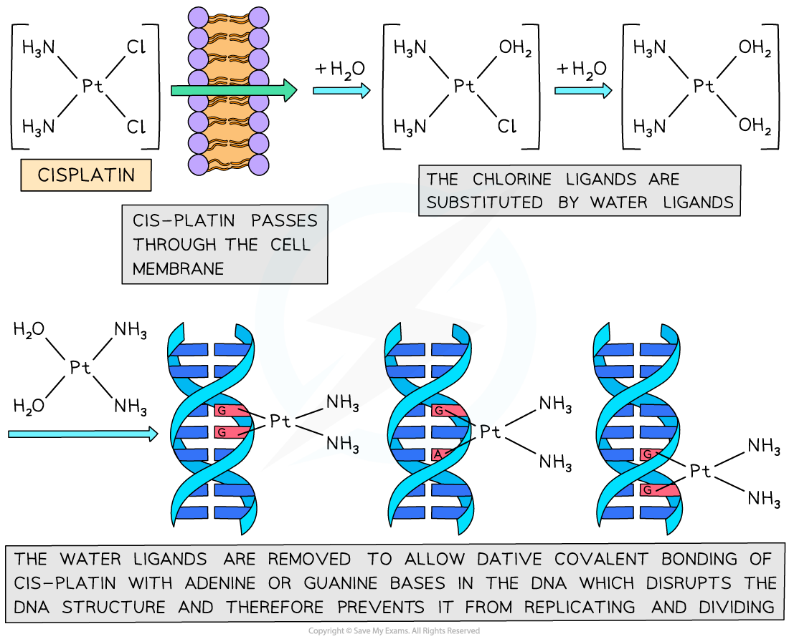

Cis-platin
----------

* Sometimes, complexes with <b>four coordinate bonds </b>may adopt a <b>square planar</b> geometry instead of a tetrahedral one

  + Cyanide ions (CN-) are the most common ligands to adopt this geometry
  + An example of a square planar complex is <b>cisplatin</b>
* The bond angles in a square planar complex are 90o

<i><b>Cisplatin is an example of a square planar complex</b></i>

* In the 1960s the drug cis-platin was discovered, which has been extremely effective in treating a number of different types cancer such as testicular, ovarian, cervical, breast, lung and brain cancer
* Cancer cells grow and replicate much faster than normal cells
* Cis-platin is a square planar molecule that has a geometric isomer with the side groups in different positions

<i><b>The structures of cis-platin and trans-platin</b></i>

* The cis-platin works by binding to the nitrogen atoms on the bases in DNA
* The cis-platin passes through the cell membrane and undergoes ligand exchange where the chlorines are replaced by water molecules
* The nitrogen is a better ligand than water and forms dative covalent bonds with the cis-platin
* The cis-platin distorts the shape of the DNA and prevents the DNA from replicating

<i><b>The process by which cis-platin binds to DNA and prevents replication</b></i>

#### Adverse Effects

* Cis-platin binds to healthy cells as well as cancerous cells, but affects cancer cells more as they are replicating faster
* Unfortunately, this means that other healthy cells which replicate quickly, such as hair follicles, are also affected by cis-platin
* This is why hair loss is a side-effect of people undergoing cancer treatment
* Despite this drawback, cisplatin is a highly effective drug and society needs to find a balance between the adverse effects of drugs and their therapeutic value
* New therapeutic pathways are constantly under development that aim to deliver drugs that target cancer cells while leaving healthy cells untouched