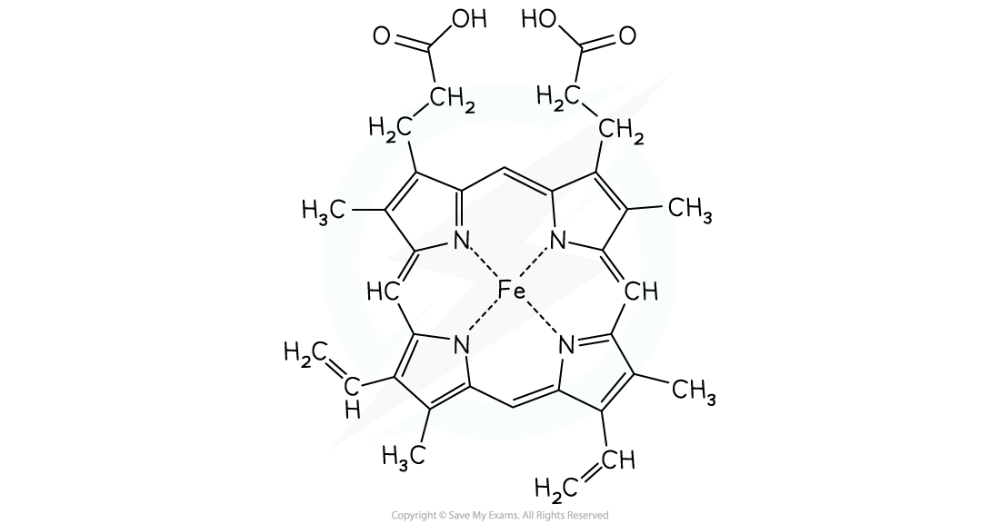

Haemoglobin
-----------

* Haemoglobin is one of nature's complexes using a transition metal ion
* The haem molecule is a complex with iron(II) at its centre
* The haemoglobin complex contains a multidentate ligand made up of four haem groups

  + These consist of mostly carbon and hydrogen atoms
  + Each haem group has a nitrogen atom forming a dative covalent bond to the Fe2+ ion in a square planar complex
* There is a fifth dative bond from the protein (globin) to the Fe2+ ion
* Oxygen atoms form a dative covalent bond with the iron(II) which enables oxygen molecules to be transported around the body in the blood

<i><b>The haem molecule with iron(II) at its centre</b></i>

* Oxygen molecules are not very good ligands and bond weakly to the iron(II)
* The weak bonds allows them to break off easily and be transported into cells

#### Examiner Tips and Tricks

You do not need to be familiar with the structure of the haem group

Ligand Exchange in Haemoglobin
------------------------------

* Carbon monoxide is toxic because it is a better ligand than oxygen and binds strongly and irreversibly to the iron(II) preventing oxygen from being carried to the cells
* If oxygen attached to the haemoglobin (oxyhaemoglobin) is replaced by carbon monoxide (carboxyhaemoglobin), a darker red colour is produced in the haem complex

  + A sign of carbon monoxide poisoning
* The condition anaemia occurs when a person does not have enough haemoglobin in their blood due to a loss of blood or deficiency in iron

  + Deficiency in iron can be restored by taking iron sulfate tables in the diet