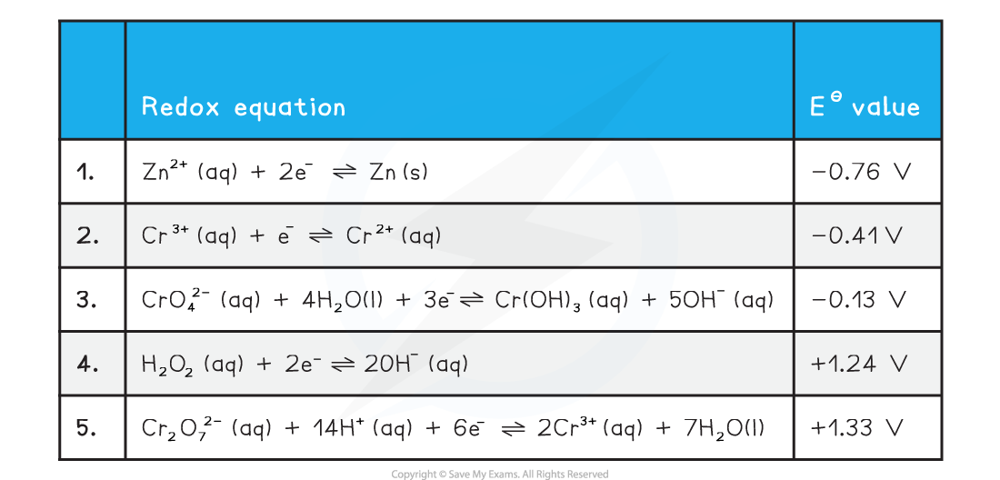

Reduction & Oxidation of Chromium Species
-----------------------------------------

* For chromium we need to consider the following standard electrode potential values
* We will use zinc and hydrogen peroxide as oxidising agents
* The half equations are arranged from high negative EΘ at the top to high positive EΘ at the bottom

  + The best reducing agent is the top right species (Zn (s))
  + The best oxidising agent is the bottom left species (Cr2O72-(aq))

#### Oxidation from +3 to +6

* The two half equations we need to consider are 3 and 4
* Chromiums oxidation number changes from +6 to +3 in half equation 3
* The EΘ value for half equation 3 is more negative than the EΘ for half equation 4

  + Cr(OH)3 (aq) is the best reducing agent
  + H2O2 (aq) is the best oxidising agent
* We can obtain the overall equation by reversing half equation 3 and combining it with equation 4

  + When adding half equations remember to multiply them so each has the same number of electrons

<b> 2Cr(OH)</b><b>3 </b><b>(aq) + 4OH</b><b>-</b><b> (aq) + 3H</b><b>2</b><b>O</b><b>2 </b><b>(aq) → 2CrO</b><b>4</b><b>2- </b><b>(aq) + 8H</b><b>2</b><b>O (l)</b>

* This reaction is carried out in alkaline conditions due to the presence of OH- ions in the equation

#### Reduction from +6 to +3

* The two half equations we need to consider are 1 and 5
* Chromiums oxidation number changes from +6 to +3 in half equation 3
* The EΘ value for half equation 1 is more negative than the EΘ for half equation 5

  + Zn is the best reducing agent
  + Cr2O72- is the best oxidising agent
* We can obtain the overall equation by reversing half equation 1 and combining it with equation 5

  + When adding half equations remember to multiply them so each has the same number of electrons

<b> Cr</b><b>2</b><b>O</b><b>7</b><b>2-</b><b> </b><b>(aq) + 14H</b><b>+</b><b> (aq) + 3Zn (s) → 2Cr</b><b>3+ </b><b>(aq) + 7H</b><b>2</b><b>O (l) + 3Zn</b><b>2+</b><b> (aq)</b>

* This reaction is carried out under acidic conditions due to presence of H+ in the equation

#### Reduction from +3 to +2

* The Cr3+ ion can be further reduced by zinc
* The two half equations we need to consider are 1 and 2
* Chromiums oxidation number changes from +3 to +2 in half equation 3
* The EΘ value for half equation 1 is more negative than the EΘ for half equation 2

  + Zn (s) is the best reducing agent
  + Cr3+ (aq) is the best oxidising agent
* We can obtain the overall equation by reversing half equation 1 and combining it with equation 2

  + When adding half equations remember to multiply them so each has the same number of electrons

<b> 2Cr</b><b>3+ </b><b>(aq) + Zn</b><b>  </b><b>(s) → 2Cr</b><b>2+ </b><b>(aq) + Zn</b><b>2+</b><b> (aq)</b>

* As this reaction is a further step from the previous reduction this reaction is also carried out under acidic conditions

The Dichromate(VI) - Chromate(VI) Equilibrium
---------------------------------------------

* The chromate CrO42- and dichromate Cr2O72- ions can be converted from one to the other by the following equilibrium reaction

<b>2CrO</b><b>4</b><b>2-</b><b> (aq) + 2H</b><b>+ </b><b>(aq) ⇌ Cr</b><b>2</b><b>O</b><b>7</b><b>2-</b><b> (aq) + H</b><b>2</b><b>O (l) </b>

* Chromate(VI) ions are stable in alkaline solution, but in acidic conditions the dichromate(VI) ion is more stable
* Addition of acid will push the equilibrium to the dichromate

  + This results in a colour change from yellow to orange
* Addition of alkali will remove the H+ ions and push the equilibrium to the chromate
* This is not a redox reaction as both the chromate and dichromate ions have an oxidation number of +6

  + This is an acid base reaction