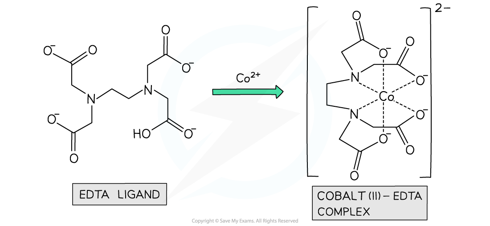

Ligand Exchange
---------------

* <b>Ligand exchange </b>(or <b>ligand</b> <b>substitution</b>) is when one <b>ligand</b> in a complex is replaced by another
* Ligand exchange forms a new complex that is <b>more stable</b> than the original one
* The ligands in the original complex can be <b>partially</b> or <b>entirely</b> substituted by others
* The complex ion can change its charge or remain the same depending on the ligand involved
* There are no changes in coordination number, or the geometry of the complex, if the ligands are of a<b> similar</b> <b>size</b>
* But, if the ligands are of a <b>different size</b>, for example water ligands and chloride ligands, then a change in coordination number and the geometry of the complex will occur

* Addition of a high concentration of chloride ions (from conc HCl or saturated NaCl) to an aqueous ion leads to a ligand substitution reaction.
* The Cl- ligand is <b>larger</b> than the uncharged H2O and NH3 ligands so therefore ligand exchange can involve a change of co-ordination number
* For example when concentrated hydrochloric acid is added slowly and continuously to a copper(II) sulfate solution the colour changes from blue to green then finally yellow
* The equation for this reaction is

<b>[Cu(H</b><b>2</b><b>O)</b><b>6</b><b>]</b><b>2+ </b><b>(aq) + 4Cl</b><b>-</b><b> (aq) ⇌ [CuCl</b><b>4</b><b>]</b><b>2-</b><b> (aq) + 6H</b><b>2</b><b>O (l) </b>

* We can see that all six water ligands have been replaced by four chloride ions
* This reaction involves a change in coordination number from 6 to 4
* Note that despite the charge on the complex changing from +2 to -2, there has been no change in oxidation number of the copper
* We can also see that this reaction is reversible, which helps to explain the observed colour change

  + The hexaaquacopper(II) ion is blue
  + The tetrachlorocuprate(II) ion is yellow
  + The green colour is due to a mixture of the blue and yellow complex ions
* A similar reaction also takes place with cobalt resulting in a blue solution and a change in coordination number from 6 to 4

<b>[Co(H</b><b>2</b><b>O)</b><b>6</b><b>]</b><b>2+ </b><b>(aq) + 4Cl</b><b>-</b><b> (aq) ⇌ [CoCl</b><b>4</b><b>]</b><b>2-</b><b> (aq) + 6H</b><b>2</b><b>O (l) </b>

#### Examiner Tips and Tricks

<b>Be careful</b>: If solid copper chloride (or any other metal) is dissolved in water it forms the aqueous [Cu(H2O)6]2+ complex and not the chloride [CuCl4 ]2- complex

The Chelate Effect & Stability
------------------------------

* The replacement of monodentate ligands with bidentate and multidentate ligands in complex ions is called the <b>chelate effect</b>
* It is an energetically favourable reaction, meaning that <b>Δ</b><i><b>G</b></i><b>ꝋ</b> is negative
* The driving force behind the reaction is entropy
* The Gibbs equation reminds us of the link between enthalpy and entropy:

<b>Δ</b><i><b>G</b></i><b>ꝋ</b><b> = Δ</b><i><b>H</b></i><i><b>reaction</b></i><b>ꝋ</b><b> – TΔ</b><i><b>S</b></i><i><b>system</b></i><b>ꝋ</b>

* Reactions in solution between aqueous ions usually come with relatively small enthalpy changes
* However, the entropy changes are always positive in chelation because the reactions produce a net increase in the number of particles
* A small enthalpy change and relative large positive entropy change generally ensures that the overall free energy change is negative
* For example, when EDTA chelates with aqueous cobalt(II) two reactants becomes seven product species

<b>[Co(H</b><b>2</b><b>O)</b><b>6 </b><b>]</b><b>2+</b><b> (aq) + EDTA</b><b>4- </b><b>(aq) → [CoEDTA]</b><b>2-</b><b> (aq) + 6H</b><b>2</b><b>O</b><b> </b><b>(l) </b>

<i><b>The ligand EDTA readily chelates with aqueous transition metal ions in an energetically favourable reaction</b></i>