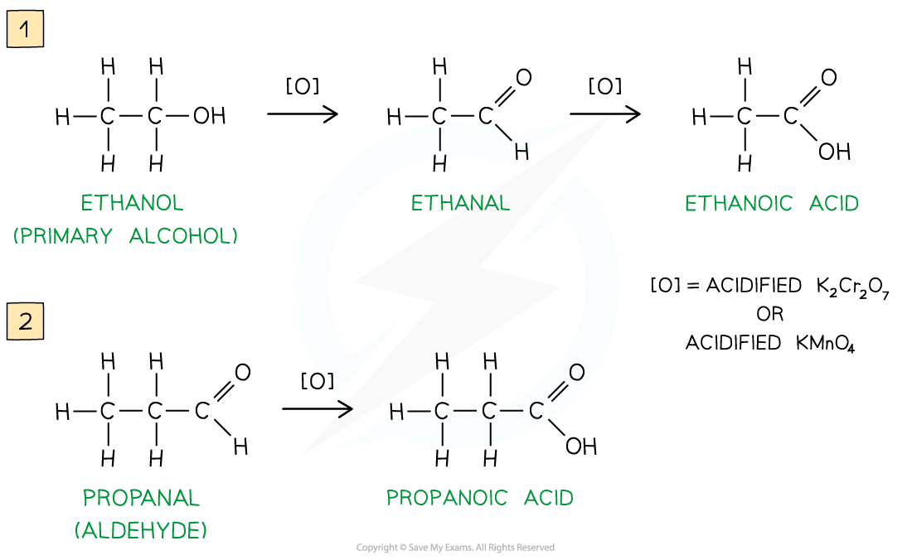
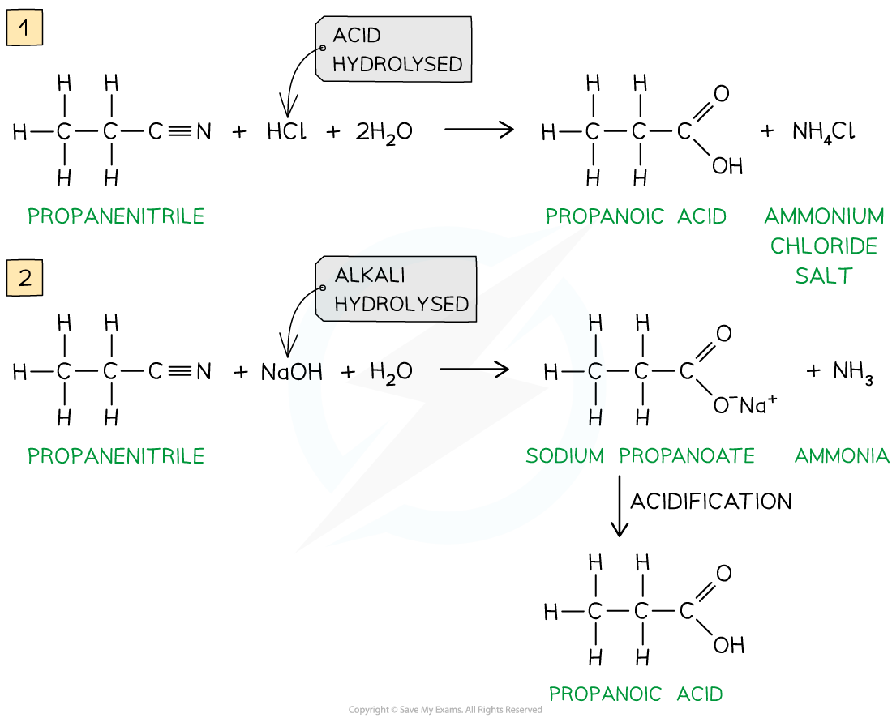

Preparation of Carboxylic Acids
-------------------------------

* <b>Carboxylic acids </b>are compounds with a -COOH functional group
* They can be prepared by a series of different reactions

#### Oxidation of primary alcohols & aldehydes

* Carboxylic acids can be formed from the <b>oxidation</b> of <b>primary alcohols </b>and <b>aldehydes </b>by either <b>acidified K</b><b>2</b><b>Cr</b><b>2</b><b>O</b><b>7</b><b> </b>or <b>acidified KMnO</b><b>4</b><b> </b>and <b>reflux</b>
* The oxidising agents themselves get reduced causing the solutions to change colour

  + In K2Cr2O7 the orange dichromate ions (Cr2O72-) are reduced to green Cr3+ ions
  + In KMnO4<b>  </b>the purple manganate ions (MnO4-) are reduced to colourless Mn2+ ions

<i><b>Oxidation of primary alcohols (1) and aldehydes (2) gives carboxylic acids</b></i>

#### Hydrolysis of nitriles

* Carboxylic acids can also be prepared from the <b>hydrolysis </b>of <b>nitriles</b> using either <b>dilute acid </b>or <b>dilute alkali followed by acidification</b>

  + Hydrolysis by dilute acid results in the formation of a carboxylic acid and ammonium salt
  + Hydrolysis by dilute alkali results in the formation of a sodium carboxylate salt and ammonia; Acidification is required to change the carboxylate ion into a carboxylic acid
* The -CN group at the end of the hydrocarbon chain is converted to a -COOH group

<i><b>Hydrolysis of nitriles by either dilute acid (1) or dilute alkali and acidification (2) will form a carboxylic acid</b></i>