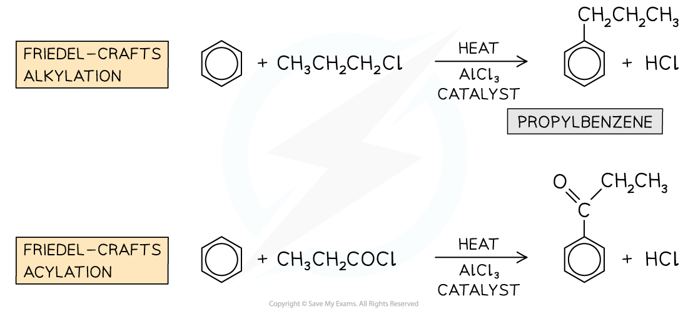

Reactions of Benzene
--------------------

#### Reaction with oxygen

* Hydrocarbons will burn in air or oxygen to produce carbon dioxide and water providing sufficient oxygen is available
* Benzene reacts will also follow this pattern

<b>2C</b><b>6</b><b>H</b><b>6</b><b> (l) + 15O</b><b>2</b><b> (g) → 12CO</b><b>2</b><b> (g) + 6H</b><b>2</b><b>O (g)</b>

* Given that a large volume of oxygen is required for this reaction, incomplete combustion could occur

  + Therefore unreacted benzene may remain
* This would lead to a smokey yellow flame as there would be insufficient oxygen available

#### Halogenation

* The nature of benzene is different to other unsaturated compounds such as alkenes and halogenation via electrophilic addition is not possible
* Therefore aromatic compounds will react with halogens in the presence of a <b>metal halide carrier</b>

  + iron(III) bromide
  + aluminium chloride
* The reaction of the metal halide carrier acts as catalyst and creates the electrophile, X+(where X represents a halogen atom)
* At the end of the reaction it is regenerated

<b>AlCl</b><b>3</b><b> + Cl</b><b>2</b><b> → AlCl</b><b>4</b><b>-</b><b> + Cl</b><b>+</b>

<b>FeBr</b><b>3</b><b> + Br</b><b>2 </b><b>→ FeBr</b><b>4</b><b>-</b><b> + Br</b><b>+</b>

* The overall equation for halogenation is

<b>C</b><b>6</b><b>H</b><b>6 </b><b>+ X</b><b>2</b><b> → C</b><b>6</b><b>H</b><b>5</b><b>X + HX</b>

<b>Or with Br</b><b>2</b><b> in the presence of a AlBr</b><b>3</b>

<b>C</b><b>6</b><b>H</b><b>6 </b><b>+ Br</b><b>2</b><b> → C</b><b>6</b><b>H</b><b>5</b><b>Br + HBr</b>

<i><b>Bromination of benzene</b></i>

* Remember that one hydrogen atom on the benzene ring has been substituted for one halogen atom, therefore HX will be a product

#### Nitration

* Another example of a substitution reaction is the <b>nitration </b>of arenes
* In these reactions, a nitro (-NO2) group replaces a hydrogen atom on the arene
* The benzene is reacted with a mixture of concentrated nitric acid (HNO3) and concentrated sulfuric acid (H2SO4) at a temperature between 25 and 60 oC

<i><b>Nitration of benzene</b></i>

#### Friedel-Crafts Reactions

* Friedel-Crafts reactions are also<b> </b>substitution<b> </b>reactions
* Due to the aromatic stabilisation in arenes, they are often <b>unreactive</b>
* To use arenes as <b>starting materials </b>for the synthesis of other organic compounds, their structure, therefore, needs to be changed to turn them into more reactive compounds
* Friedel-Crafts reactions can be used to substitute a hydrogen atom in the benzene ring for an <b>alkyl group </b>(Friedel-Crafts alkylation) or an <b>acyl group </b>(Friedel-Crafts acylation)
* Like any other electrophilic substitution reaction, the Friedel-Crafts reactions consist of three steps:

  + Generating the electrophile
  + Electrophilic attack on the benzene ring
  + Regenerating aromaticity of the benzene ring

<i><b>Examples of Friedel-Crafts alkylation and acylation reactions</b></i>