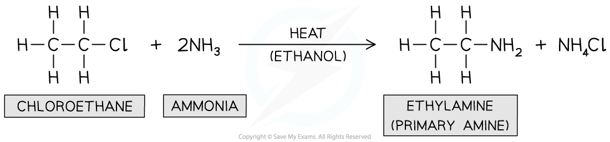
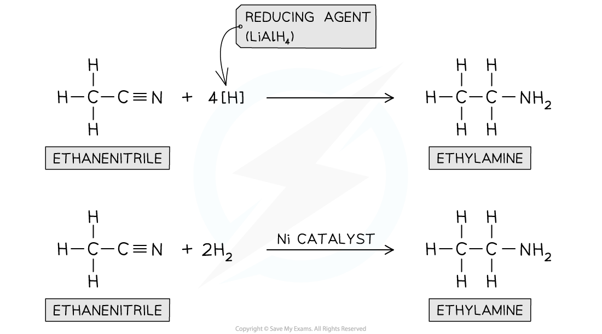

Reactions of Primary Aliphatic Amines
-------------------------------------

#### Reactions with water

* The first few members of the homologous series of primary aliphatic amines are miscible with water

  + However as the hydrocarbon part of the molecule becomes longer, the solubility decreases
  + Phenylamine is only slightly soluble in water
* They dissolve in water as they are able to form hydrogen bonds with water molecules
* Amines also react slightly with water to form alkaline solutions

<b>CH</b><b>3</b><b>NH</b><b>2</b><b> + H</b><b>2</b><b>O ⇌ CH</b><b>3</b><b>NH</b><b>3</b><b>+</b><b> + OH</b><b>-</b>

#### Reactions with acids

* Amines react with strong acids to form ionic ammonium salts

<b>CH</b><b>3</b><b>NH</b><b>2</b><b> (aq) + HCl (aq) → CH</b><b>3</b><b>NH</b><b>3</b><b>+</b><b>Cl</b><b>- </b><b>(aq)</b>         Methylamine           methylammonium chloride

* Addition of NaOH to an ammonium salt will convert it back to the amine
* These ionic salts will be solid crystals, if the water is evaporated, because of the strong ionic interactions
* The ionic salts formed in this reaction means that the compounds are soluble in the acid

  + e.g. Phenylamine is not very soluble in water but phenylammonium chloride is soluble

#### Reactions with ethanoyl chloride

* This reaction type is addition-elimination reaction meaning two molecules join together, and then a small molecule is eliminated - in these examples, hydrogen chloride

  + You do not need to know the mechanism of these reactions
* The organic product contains a new functional group - amide - in which a carbonyl group is next to an NH group
* The equation for the reaction of butylamine with ethanoyl chloride is

<b>CH</b><b>3</b><b>COCl + CH</b><b>3</b><b>CH</b><b>2</b><b>CH</b><b>2</b><b>CH</b><b>2</b><b>NH</b><b>2</b><b> → CH</b><b>3</b><b>CONHCH</b><b>2</b><b>CH</b><b>2</b><b>CH</b><b>2</b><b>CH</b><b>3</b><b> + HCl</b>

#### Reaction with halogenoalkanes

* Again you do not need to know the mechanism for these reactions
* The electron-deficient carbon atom in the halogenoalkane and the electron-rich atom nitrogen atom in the amine causes these two species to react together
* The general formula for this reaction would be

<b>R'NH</b><b>2</b><b> + R"X → R'NHR" + HX</b>

* Where R' is the alkyl group in the amine and R" is the alkyl group in the halogenoalkane
* This reaction is an example of a substitution reaction
* The organic product is a secondary amine and the inorganic product is a hydrogen halide, often hydrogen chloride
* As an example, the equation for the reaction of butylamine and chloroethane is

<b>CH</b><b>3</b><b>CH</b><b>2</b><b>CH</b><b>2</b><b>CH</b><b>2</b><b>NH</b><b>2</b><b> +  CH</b><b>3</b><b>CH</b><b>2</b><b>Cl → CH</b><b>3</b><b>CH</b><b>2</b><b>CH</b><b>2</b><b>CH</b><b>2</b><b>NHCH</b><b>2</b><b>CH</b><b>3 </b><b>+ HCl</b>

* The organic product contains an electron-rich nitrogen atom, so can also react with chloroethane

<b>CH</b><b>3</b><b>CH</b><b>2</b><b>CH</b><b>2</b><b>CH</b><b>2</b><b>NHCH</b><b>2</b><b>CH</b><b>3</b><b> +  CH</b><b>3</b><b>CH</b><b>2</b><b>Cl →  CH</b><b>3</b><b>CH</b><b>2</b><b>CH</b><b>2</b><b>CH</b><b>2</b><b>N(CH</b><b>2</b><b>CH</b><b>3</b><b>)</b><b>2 </b><b>+ HCl</b>

* The organic product of this reaction is a tertiary amine
* The organic product also contains an electron-rich nitrogen atom, so can also react with chloroethane

<b>CH</b><b>3</b><b>CH</b><b>2</b><b>CH</b><b>2</b><b>CH</b><b>2</b><b>N(CH</b><b>2</b><b>CH</b><b>3</b><b>)</b><b>2</b><b> +  CH</b><b>3</b><b>CH</b><b>2</b><b>Cl → CH</b><b>3</b><b>CH</b><b>2</b><b>CH</b><b>2</b><b>CH</b><b>2</b><b>N</b><b>+</b><b>(CH</b><b>2</b><b>CH</b><b>3</b><b>)</b><b>3</b><b>Cl</b><b>-</b>

* In this reaction HCl is not formed because this would require the loss of H from the nitrogen from the organic reactant, which the tertiary amine doesn't have
* The product is an ionic compound related to ammonium chloride except that all the hydrogens in the ammonium ion have been replaced by alkyl groups

  + This is known as a quaternary ammonium salt

#### Reactions with copper(II) ions

* Ammonia can act as a lone pair donor in its reactions with transition metal ions
* For example the overall equation for the reaction of ammonia with hexaaquacopper(II) ions is

<b>[Cu(H</b><b>2</b><b>O)</b><b>6</b><b>]</b><b>2+</b><b> + 4NH</b><b>3</b><b>→ [Cu(NH</b><b>3</b><b>)</b><b>4</b><b>(H</b><b>2</b><b>O)</b><b>2</b><b>]</b><b>2+</b><b> + 4H</b><b>2</b><b>O</b>

* Amines also have a lone pair of electrons on the nitrogen, so can take part in similar reactions
* The observations are the same as with ammonia

  + A blue precipitate forms
  + With excess butylamine the precipitate dissolves to give a blue solution
* Formation of the pale blue precipitate

<b>[Cu(H</b><b>2</b><b>O)</b><b>6</b><b>]</b><b>2+</b><b> + 2CH</b><b>3</b><b>CH</b><b>2</b><b>CH</b><b>2</b><b>CH</b><b>2</b><b>NH</b><b>2 </b><b>→ [Cu(H</b><b>2</b><b>O)</b><b>4</b><b>(OH)</b><b>2</b><b>] + 2CH</b><b>3</b><b>CH</b><b>2</b><b>CH</b><b>2</b><b>CH</b><b>2</b><b>NH</b><b>3</b><b>+</b>

* Formation of the deep blue solution

<b>[Cu(H</b><b>2</b><b>O)</b><b>4</b><b>(OH)</b><b>2</b><b>] + 4CH</b><b>3</b><b>CH</b><b>2</b><b>CH</b><b>2</b><b>CH</b><b>2</b><b>NH</b><b>2 </b><b>→ [Cu(CH</b><b>3</b><b>CH</b><b>2</b><b>CH</b><b>2</b><b>CH</b><b>2</b><b>NH</b><b>2</b><b>)</b><b>4</b><b>(H</b><b>2</b><b>O)</b><b>2</b><b>]</b><b>2+</b><b> + 2H</b><b>2</b><b>O +2OH</b><b>-</b>

Preparation of Primary Aliphatic Amines
---------------------------------------

#### Preparing Amines

* Primary amines can be prepared from different reactions including:

  + The reaction of halogenoalkanes with ammonia
  + The reduction of nitriles

#### Reaction of halogenoalkanes with ammonia

* This is a <b>nucleophilic substitution </b>reaction in which the nitrogen lone pair in ammonia acts as a <b>nucleophile </b>and <b>replaces </b>the halogen in the halogenoalkane
* When a halogenoalkane is reacted with <b>excess, hot ethanolic ammonia under pressure </b>a <b>primary amine </b>is formed

<i><b>Formation of primary amine</b></i>

#### Reduction of nitriles

* Nitriles contain a -CN functional group which can be <b>reduced</b> to an -NH2 group
* The nitrile vapour and <b>hydrogen gas </b>are passed over a <b>nickel catalyst </b>or <b>LiAlH</b><b>4</b><b> </b>in <b>dry ether</b> can be used to form a <b>primary amine</b>

<i><b>Nitriles can be reduced with LiAlH</b></i><i><b>4</b></i><i><b> or H</b></i><i><b>2</b></i><i><b> and Ni catalyst</b></i>