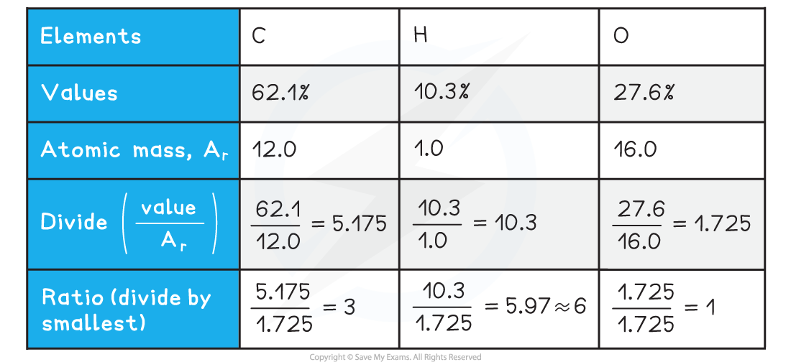

Deducing Organic Structures
---------------------------

* You will be expected to deduce the empirical, molecular and structural formulae of compounds from data such as:

  + Combustion analysis
  + Elemental percentage composition - also known as calculating empirical formulae
  + Characteristic reactions of functional groups - this can include test-tube reactions as well as interconversions
  + Infrared (IR) spectra
  + Mass spectra (MS)
  + Nuclear magnetic resonance (NMR) spectra
* The normal progression for the analysis of a compound is:

  1. Find the empirical formula
  2. Determine the molecular formula
  3. Identify the functional groups / structural components present
  4. Deduce the overall structure

#### Combustion analysis

* Sometimes combustion analysis is performed on an unknown compound to determine the elemental percentage composition
* The elemental percentage composition is then used to calculate the empirical formula
* In combustion analysis, a known mass of the compound is burned in an excess of dry oxygen
* The mass of carbon dioxide and water are then used to determine the percentage content of carbon, hydrogen and oxygen in the compound

  + This can also be applied to include sulfur and nitrogen, although you are not expected to do this, at this level
* To convert combustion analysis data to elemental percentage composition:

  1. Calculate the mass of carbon in the sample from the combustion analysis results
  2. Calculate the percentage of carbon in the sample
  3. Calculate the mass of hydrogen in the sample from the combustion analysis results
  4. Calculate the percentage of hydrogen in the sample
  5. Use the percentage of carbon and hydrogen to deduce the percentage of oxygen in the sample

#### Worked Example

Combustion analysis was performed on 2.90 g of an unknown carbohydrate, A.

6.60 g of carbon dioxide and 2.70 g of water were produced.

Calculate the carbohydrates percentage composition.

<b>   Answer</b>

<b>   Step 1: </b>Calculate the mass of carbon in the sample

* Mass of carbon = <math><semantics><mrow><mfrac><mrow><mi>mass</mi><mo> </mo><mi>of</mi><mo> </mo><mi>carbon</mi></mrow><mrow><mi>molecular</mi><mo> </mo><mi>mass</mi><mo> </mo><mi>of</mi><mo> </mo><mi>carbon</mi><mo> </mo><mi>dioxide</mi></mrow></mfrac><mo>×</mo><mi>mass</mi><mo> </mo><mi>of</mi><mo> </mo><mi>carbon</mi><mo> </mo><mi>dioxide</mi><mo> </mo><mi>produced</mi></mrow><annotation>{"language":"en","fontFamily":"Times New Roman","fontSize":"18"}</annotation></semantics></math>

  + Mass of carbon = <math><semantics><mrow><mo>=</mo><mfrac><mrow><mn>12</mn><mo>.</mo><mn>0</mn></mrow><mrow><mn>44</mn><mo>.</mo><mn>0</mn></mrow></mfrac><mo>×</mo><mn>6</mn><mo>.</mo><mn>60</mn><mo>=</mo><mn>1</mn><mo>.</mo><mn>80</mn><mo> </mo><mi>g</mi></mrow><annotation>{"language":"en","fontFamily":"Times New Roman","fontSize":"18"}</annotation></semantics></math>

<b>   Step 2: </b>Calculate the percentage of carbon in the sample

* Percentage carbon = <math><semantics><mrow><mfrac><mrow><mi>mass</mi><mo> </mo><mi>of</mi><mo> </mo><mi>carbon</mi><mo> </mo><mi>in</mi><mo> </mo><mi>sample</mi></mrow><mrow><mi>mass</mi><mo> </mo><mi>of</mi><mo> </mo><mi>sample</mi></mrow></mfrac><mo>×</mo><mn>100</mn></mrow><annotation>{"language":"en","fontFamily":"Times New Roman","fontSize":"18"}</annotation></semantics></math>

  + Percentage carbon <math><semantics><mrow><mo>=</mo><mfrac><mrow><mn>1</mn><mo>.</mo><mn>80</mn></mrow><mrow><mn>2</mn><mo>.</mo><mn>90</mn></mrow></mfrac><mo>×</mo><mn>100</mn><mo>=</mo><mn>62</mn><mo>.</mo><mn>1</mn><mo>%</mo></mrow><annotation>{"language":"en","fontFamily":"Times New Roman","fontSize":"18"}</annotation></semantics></math>

<b>   Step 3: </b>Calculate the mass of hydrogen in the sample

* Mass of hydrogen = <math><semantics><mrow><mfrac><mrow><mi>TOTAL</mi><mo> </mo><mi>mass</mi><mo> </mo><mi>of</mi><mo> </mo><mo> </mo><mi>hydrogen</mi><mo> </mo></mrow><mrow><mi>molecular</mi><mo> </mo><mi>mass</mi><mo> </mo><mi>of</mi><mo> </mo><mi>water</mi></mrow></mfrac><mo>×</mo><mi>mass</mi><mo> </mo><mi>of</mi><mo> </mo><mi>water</mi><mo> </mo><mi>produced</mi></mrow><annotation>{"language":"en","fontFamily":"Times New Roman","fontSize":"18"}</annotation></semantics></math>

  + Mass of hydrogen = <math><semantics><mrow><mo>=</mo><mfrac><mrow><mn>2</mn><mo>.</mo><mn>0</mn></mrow><mrow><mn>18</mn><mo>.</mo><mn>0</mn></mrow></mfrac><mo>×</mo><mn>2</mn><mo>.</mo><mn>70</mn><mo>=</mo><mn>0</mn><mo>.</mo><mn>30</mn><mo> </mo><mi>g</mi></mrow><annotation>{"language":"en","fontFamily":"Times New Roman","fontSize":"18"}</annotation></semantics></math>

<b>   Step 4: </b>Calculate the percentage of hydrogen in the sample

* Percentage hydrogen = <math><semantics><mrow><mfrac><mrow><mi>mass</mi><mo> </mo><mi>of</mi><mo> </mo><mo> </mo><mi>hydrogen</mi><mo> </mo><mo> </mo><mi>in</mi><mo> </mo><mi>sample</mi></mrow><mrow><mi>mass</mi><mo> </mo><mi>of</mi><mo> </mo><mi>sample</mi></mrow></mfrac><mo>×</mo><mn>100</mn></mrow><annotation>{"language":"en","fontFamily":"Times New Roman","fontSize":"18"}</annotation></semantics></math>

  + Percentage hydrogen <math><semantics><mrow><mo>=</mo><mfrac><mrow><mn>0</mn><mo>.</mo><mn>30</mn></mrow><mrow><mn>2</mn><mo>.</mo><mn>90</mn></mrow></mfrac><mo>×</mo><mn>100</mn><mo>=</mo><mn>10</mn><mo>.</mo><mn>3</mn><mo>%</mo></mrow><annotation>{"language":"en","fontFamily":"Times New Roman","fontSize":"18"}</annotation></semantics></math>

<b>   Step 5: </b>Calculate the percentage of oxygen in the sample

* Percentage oxygen = 100 - percentage of carbon - percentage of hydrogen

  + Percentage oxygen = 100 - 62.1 - 10.3 = 27.6%
  + Therefore, the percentage composition of the carbohydrate is 62.1% carbon, 10.3% hydrogen and 27.6% oxygen

#### Examiner Tips and Tricks

Don't forget to use 2.0 g for the mass of hydrogen as there are two hydrogen atoms in a water molecule

#### Worked Example

Calculate the empirical formula for the unknown carbohydrate, A

<b>   Answer</b>

* The percentage composition of the unknown carbohydrate, A, is 62.1% carbon, 10.3% hydrogen and 27.6% oxygen

* Empirical formula = C3H6O

#### Characteristic reactions of functional groups

* For deducing structures, these will typically be the test-tube reactions, including (but not limited to):

  + Bromine: C=C bond
  + Acidified potassium dichromate(VI) solution: primary and secondary alcohols
  + Fehling's or Tollens': aldehydes and ketones
  + 2,4-dinitrophenylhydrazine (2,4-DNPH): C=O bond
  + Sodium carbonate: carboxylic acids
  + Iodoform: Methyl groups next to C=O

#### Spectral analysis

* These will include:

  + Infrared spectroscopy: to identify functional groups and certain bond types
  + Mass spectrometry: to identify molecular formula and fragments
  + Carbon-13 (13C) nuclear magnetic resonance: to identify compound structure
  + Proton (1H) nuclear magnetic resonance: to identify compound structure