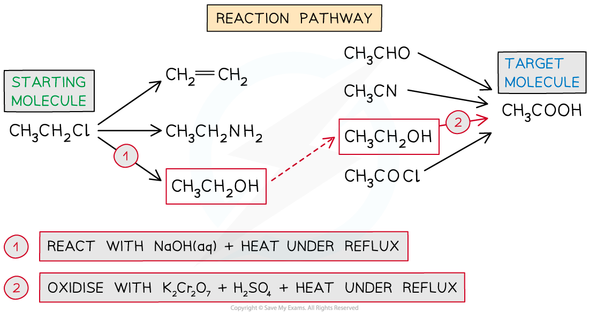

Planning Reaction Schemes
-------------------------

* A large number of organic products are made from a few starting compounds using appropriate reagents and conditions
* Knowing how organic functional groups are related to each other is key to the synthesis of a given molecule
* The main functional groups you need to know are

  + Alkanes
  + Alkenes
  + Haloalkanes
  + Nitriles
  + Amines
  + Alcohols
  + Carbonyls (aldehydes & ketones)
  + Hydroxynitriles
  + Carboxylic acids
  + Esters
  + Acyl chlorides
  + Primary and secondary amides

#### Aliphatic Reaction Pathways

* The key interconversions between functional groups are summarised here:

<b>Aliphatic Reactions Table</b>

|  |  |  |  |
| --- | --- | --- | --- |
| <b>Reactant</b> | <b>Product</b> | <b>Reagents</b> | <b>Reaction</b> |
| Alkene | Haloalkane | X2 / HX | Electrophilic addition |
| Alkene | Alcohol | Steam + H2SO4 / heat | Hydration |
| Alkene | Alkane | Hydrogen + Ni catalyst / 150 oC | Electrophilic addition / hydrogenation |
| Alcohol | Alkene | Al2O3 or conc. H2SO4 / heat | Elimination / dehydration |
| Alcohol | Haloalkane | NaX + H2SO4 / reflux | Nucleophilic substitution |
| Haloalkane | Alcohol | NaOH (aq) / reflux | Nucleophilic substitution |
| Alkane | Haloalkane | Halogen / UV light | Free radical substitution |
| Primary alcohol | Aldehyde | K2Cr2O7 / H2SO4 / distil | Oxidation |
| Secondary alcohol | Ketone | K2Cr2O7 / H2SO4 / Heat | Oxidation |
| Primary alcohol | Carboxylic acid | K2Cr2O7 / H2SO4 / reflux | Oxidation |
| Aldehyde | Primary alcohol | NaBH4 / H2O | Reduction / nucleophilic addition |
| Ketone | Secondary alcohol | NaBH4 / H2O | Reduction / nucleophilic addition |
| Haloalkane | Nitrile | Aqueous ethanolic KCN / Heat | Nucleophilic substitution |
| Halogenoalkane | Amine | NH3 / ethanol | Nucleophilic substitution |
| Nitrile | Carboxylic acid | H2O / HCl | Hydrolysis |
| Aldehyde | Hydroxynitrile | NaCN / H+ | Nuclophilic addition |
| Alcohol | Ester | Carboxylic acid / H2SO4 | Esterification |
| Carboxylic acid | Ester | Alcohol / H2SO4 | Esterification |
| Ester | Carboxylate salt and alcohol | NaOH (aq) | Alkaline hydrolysis |
| Ester | Carboxylic acid | Dilute acid | Acid hydrolysis |
| Carboxylic acid | Acyl chloride | SOCl2 | Chlorination |
| Acyl chloride | Carboxylic acid | H2O | Hydrolysis |
| Acyl chloride | Primary amide | NH3 | Nucleophilic addition elimination |
| Acyl chloride | Secondary amide | Primary amine | Nucleophilic addition elimination |

#### Aromatic Reaction Pathways

* The key aromatic reactions are summarised here:

<b>Aromatic Reactions Table</b>

|  |  |  |  |
| --- | --- | --- | --- |
| <b>Reactant</b> | <b>Product</b> | <b>Reagents</b> | <b>Reaction</b> |
| Benzene | Methylbenzene / toluene | CH3Cl / AlCl3 | Alkylation / Electrophilic substitution |
| Benzene | Bromobenzene | Br2 / FeBr3 | Bromination / Electrophilic substitution |
| Benzene | Chlorobenzene | Cl2 / AlCl3 | Chlorination / Electrophilic substitution |
| Benzene | Nitrobenzene | HNO3 / H2SO4 | Nitration / Electrophilic substitution |
| Nitrobenzene | Aminobenzene / phenylamine / aniline | Sn / HCl | Reduction |
| Aminobenzene | 2,4,6-tribromoaminobenzene / 2,4,6-tribromoaniline | Bromine | Electrophilic substitution |
| Benzene | Phenylethanone | CH3COCl / AlCl3 | Acylation / Electrophilic substitution |
| Phenylethanone | 1-phenylethanol | NaBH4 | Reduction |

#### Designing a Reaction Pathway

* The given molecule is usually called the <b>target molecule</b> and chemists try to design a synthesis as efficiently as possible
* Designing a reaction pathway starts by drawing the structures of the<b> target molecule</b> and the <b>starting molecule</b>
* Determine if they have the <b>same number</b> of carbon atoms

  + If you need to lengthen the carbon chain you will need to put on a<b> nitrile group</b> by nucleophilic substitution
* Work out all the compounds that can be made from the starting molecule and all the molecules that can be made into the target molecule

  + Match the groups they have in common and work out the reagents and conditions needed

#### Worked Example

Suggest how the following syntheses could be carried out:

a) Chloroethane to ethanoic acid

b) Ethene to 1-aminopropane

<b>Answer 1</b>

<b>Answer 2</b>

#### Examiner Tips and Tricks

You could be required to design a synthesis with up to four steps

Part of this process can include identifying appropriate control measures to reduce risk, based on data about hazards