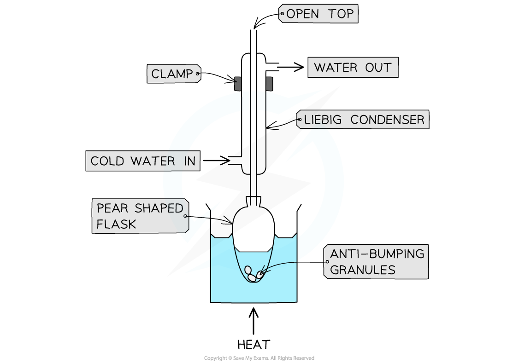

Distillation & Refluxing
------------------------

#### Simple distillation

* Simple distillation is a common practical completed in organic chemistry
* It is used as there are times that a reaction does not go to completion or there are other chemicals produced as well as the desired product
* Simple distillation allows you to separate compounds by their boiling point

  + Chemicals with the lowest boiling point will distill first
* One of the most common simple distillation practicals is the oxidation of primary and secondary alcohol to aldehydes and ketones

#### The simple distillation process

* To produce an aldehyde from a primary alcohol, a reaction mixture containing the primary alcohol and acidified potassium dichromate solution is placed into a pear-shaped or round bottomed flask
* Anti-bumping granules are added to promote smooth boiling
* Quickfit apparatus is then set up, including a still head and condenser connected to the side

  + The joints of the Quickfit apparatus are often have a thin layer of silicon grease smeared over them to give a better seal as well as to make it easier to disassemble the equipment afterwards
* A Quickfit thermometer can be used, with the thermometer bulb sitting where the vapours will pass into the condenser
* A steady and constant stream of water passes through the condenser in a 'water jacket' - it enters at the bottom of the condenser and the drainage pipe removes the water from the top of the condenser

<i><b>Heating under Distillation Apparatus</b></i>

* The reaction mixture is heated until it boils using a heating mantle

  + Electric heating mantles are used for this because the temperature can be controlled, and because you are using chemicals which are flammable
* The distillate which forms in the condenser drips directly into a receiving vessel

  + The distillate which should be collected, is that which is given off at +/- 2 oC of the boiling point of the desired product
  + Some distillate may be given off below this temperature - this needs to be discarded and a clean vessel used to collect the desired product
  + Stop collecting the distillate if the temperature rises above +/- 2oC of the boiling point of the desired product
* The <b>aldehyde</b> product has a lower boiling point than the <b>alcohol</b> (since it has lost the <b>H-bonding</b>) so it can be <b>distilled off </b>as soon as it forms

#### Steam distillation

* Steam distillation is used to separate an insoluble liquid from an aqueous solution

  + Steam is bubbled through a reaction mixture containing the aqueous solution and the insoluble liquid that forms a separate layer
  + As the steam bubbles through the reaction mixture it mixes the layers so they form part of the evaporating liquid
* Advantages of steam distillation are:

  + The insoluble liquid distils at a temperature below its usual boiling point
  + It reduces the chances of thermal decomposition of the insoluble liquid

#### Heating under reflux

* Organic reactions often occur slowly at room temperature
* Therefore, organic reactions can be completed by heating under reflux to produce an <b>organic liquid</b>
* This allows the mixture to react as fully as possible without the loss of any reactants, products or solvent

  + In distillation, you are trying to separate a chemical or product from a mixture
  + When heating under reflux, you aim to keep all the chemicals inside the reaction vessel

#### The Heating under Reflux Process:

* Example reactions where heating under reflux could be used include:

  + The production of a carboxylic acid from a primary alcohol using acidified potassium dichromate
  + The production of an ester from an alcohol and acid in the presence of an acid catalyst
* The reaction mixture is placed into a pear-shaped or round bottomed flask
* Anti-bumping granules are, again, added to promote smooth boiling
* The flask is placed in a heating mantle or it can be immersed in a water bath for heating
* Quickfit apparatus is then set up with the condenser clamped vertically in place

  + The joints of the Quickfit apparatus are commonly greased as with distillation
* A steady and constant stream of water passes through the condenser in a 'water jacket' - it enters at the bottom of the condenser and the drainage pipe removes the water from the top of the condenser
* The water is heated and the reaction mixture allowed to boil
* The heated is stopped and the mixture allowed to cool back to room temperature

<i><b>The preparation of ethyl ethanoate involves heating under reflux for about 15 minutes</b></i>

#### Examiner Tips and Tricks

* These practicals give you the opportunity to discuss:

  + The use of an electric heating mantles and water baths rather than a Bunsen burner
  + The choice and setup of laboratory apparatus
  + Health and safety considerations including the careful handling of different liquids, including those which are corrosive, irritant, flammable and toxic