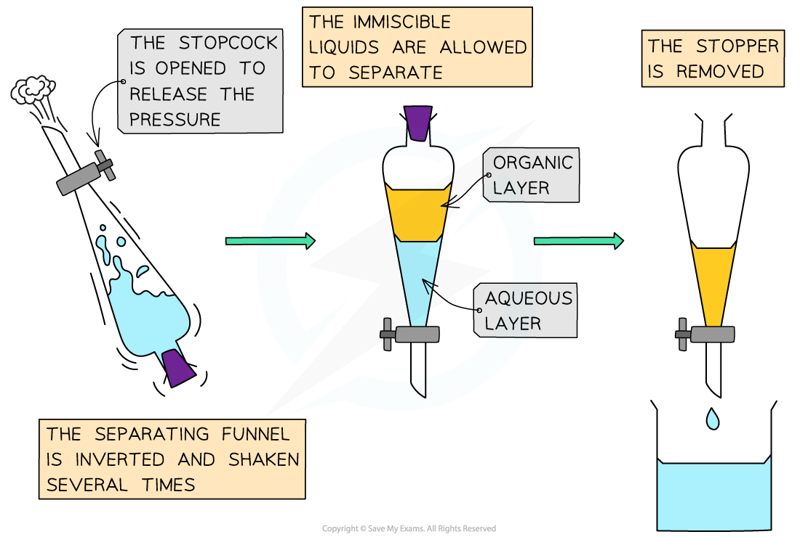
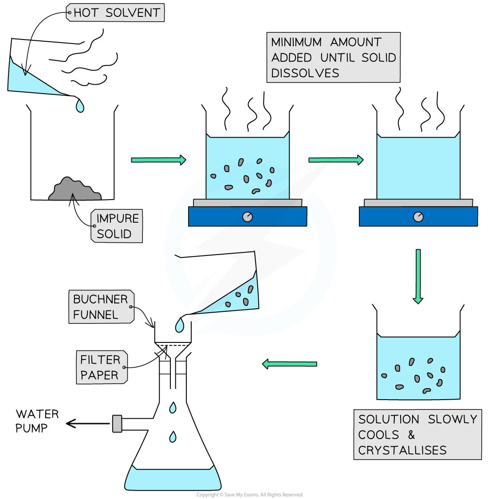

Purification Methods
--------------------

* There are different methods to purify organic compounds, including:

  + Solvent extraction / use of a separating funnel
  + Use of drying agents
  + Recrystallisation

#### Solvent extraction / use of a Separating Funnel

* When organic liquids are being prepared, water can often be obtained along with the organic product
* The water will usually form an aqueous layer with the product in the organic layer

  + It can sometimes be hard to identify which layer is the organic layer - this can be achieved by simply adding water and seeing which layer increases in volume
* Other organic reactions may need to be neutralised before being purified, this can be achieved by adding sodium carbonate solution to the reaction vessel or separating funnel

  + This can also be used to remove other impurities by washing

* The contents of the reaction vessel are transferred to a separating funnel and a stopper added
* The separating funnel is inverted and the stopcock opened to release the pressure - this is repeated 15-20 times

  + If neutralisation has occurred then the stopcock is opened slowly to avoid losing any product
* The two layers are allowed to separate

  + In the following example, the aqueous layer is the bottom layer inside the separating funnel
  + This is because the aqueous has a higher density than the organic layer
* The stop cock is opened so that the aqueous layer drains away and the organic layer can be drained into a clean beaker

<i><b>A separating funnel allows the product to be cleaned and isolated</b></i>

#### Use of drying agents

* Drying agents can be used to remove traces of water from an organic product
* Drying agents are usually anhydrous inorganic salts that readily hydrate in the presence of water

  + Anhydrous calcium chloride is commonly used to dry hydrocarbons
  + Anhydrous calcium or magnesium sulfate are used more general purpose drying agents
* A spatula of drying agent is added into the organic product and swirled

  + If the organic product has a low boiling point, a lid / stopped can be added to reduce the potential evaporation of any product
* If the drying agent clumps together, then there is still water in the organic liquid
* More drying agent is added until some remains dispersed in the organic liquid as a fine powder
* The dry organic liquid can then be decanted or filtered

  + If the organic liquid is dry then it should appear clear

#### Recrystallisation

* Recrystallisation is used to purify impure solids
* The principle is that a hot solvent is used to dissolve both the organic solid and the impurities and then as the solution cools the solid crystallises out and leaves behind the impurities in the solution
* The key is using the minimum amount of solvent to dissolve the solid and avoid loss of the product
* If any solid impurities remain in the solution, a hot filtration can be carried out
* Once the solution has cooled down to room temperature and crystallised then the product crystals can be recovered by filtration
* This is faster using Buchner apparatus in which filtration occurs under reduced pressure

<i><b>Recrystallisation and Buchner filtration </b></i>

* After filtration the product is washed with fresh cold solvent and then allowed to dry on filter paper

#### Examiner Tips and Tricks

Recrystallisation can be repeated more than once to ensure a very pure product, but each time the yield of product will decrease. Slow cooling results in bigger well defined crystals which are easier to filter and dry.