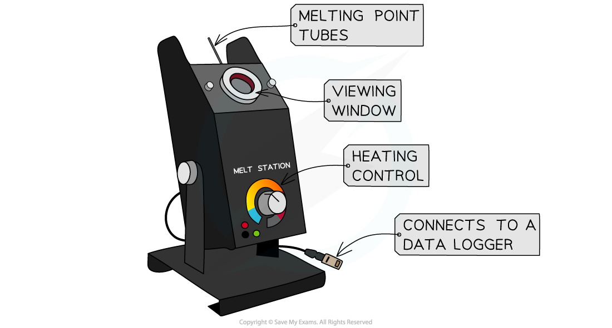

Melting & Boiling Point Determination
-------------------------------------

#### Melting point determination

* The melting point of a solid is indicative of its purity and identity
* A melting point can be matched to a known substance as a means of identification or confirmation of a desired product
* The proximity of a melting point to the actual data book value can express purity

  + Impurities tend to lower the melting point of a solid
* The melting point range also reveals the degree of purity

  + Pure substances have sharp well defined melting points
  + Impure substances have a broad melting point range, i.e. a large difference between when the substance first melts until it completely melts
* The skills needed in performing a melting point test are largely dependent on the specific melting point apparatus you are using
* However, there are some common key skills:

  + Correctly preparing the melting point tubes
  + Heating the tubes very slowly
  + Repeating to get a range of measurements (three would be normal)
* The sample solid must be totally dry and finely powdered - this can be achieved by crushing it with the back of a spatula onto some filter paper or the back of a white tile (this absorbs any moisture)
* Use the first tube to find the approximate melting point range and then repeat using a much slower heating rate

<i><b>Melting point test using an oil bath</b></i>

<i><b>Melting point test using a Thiele tube</b></i>

<i><b>Melting point test using a melt station</b></i>

#### Examiner Tips and Tricks

Always quote a melting point as a range + or - and reference a data book value if you have one.

#### Boiling point determination

* The boiling point of a liquid is indicative of its purity and identity
* Boiling point is determined by <b>distillation</b>
* The sample is gently heated until it boils and this temperature is recorded

  + This boiling point can then be compared against literature / database values
* If the sample contains impurities:

  + The boiling point may appear higher than the literature / database values
  + The sample may boil over a range of temperatures instead of at a single temperature