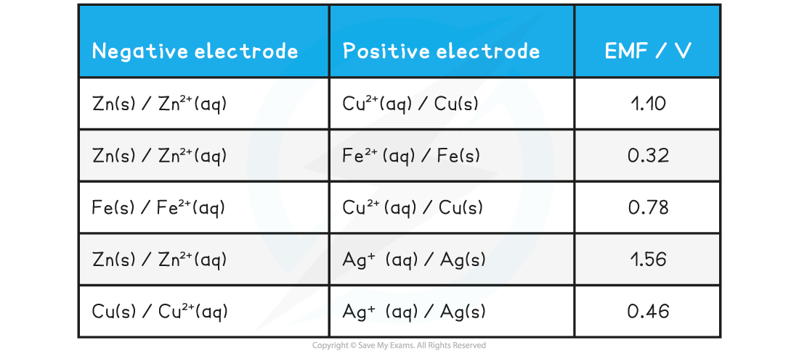

Core Practical 10: Investigating Electrochemical Cells
------------------------------------------------------

#### Measuring the EMF of a cell

* To measure a cell EMF you will need

  + Two small beakers, around 75 cm3 capacity
  + Strips of suitable metals such as copper, zinc, iron and silver
  + 1.0 mol dm-3 solutions of the metal ions (nitrates, chlorides or sulfates depending on their solubility)
  + A high resistance voltmeter (usually a digital multimeter has this)
  + Two sets of wires with crocodile clips
  + A salt bridge consisting of a strip of filter paper soaked in saturated potassium nitrate

<i><b>The experimental set up for measuring the EMF of a cell made of two metal / metal ion half cells</b></i>

<b>Steps in the procedure</b>

* The strips of metals need to be freshly cleaned to remove any oxide coatings

  + This can be done with a piece of sandpaper
* To support the metals, it is easiest to have long strips that can be folded over the side of the beaker and held in place with the crocodile clips
* Fill up the beakers to about two thirds of the way with the metal ion solutions
* Using tongs, dip a strip of filter paper into a beaker of saturated potassium nitrate solution and then place it between the two beakers making sure the ends of the strip are well immersed in the solutions
* Connect the crocodile clips to the voltmeter, wait for a steady reading and record the measurement

<b>Practical tips</b>

* If you don't get a positive reading on the voltmeter swap the terminals around
* Voltmeters will have marked positive and negative terminals (usually in red and black, respectively), so when you get a positive reading this tells you the relative polarity of the metals in the cell
* Change the salt bridge each time, to prevent cross contamination of ions between half cells

<b>Specimen Results</b>

* Here is a set of typical results for this experiment

<b>Specimen EMF Results (theoretical values) Table</b>

<b>Analysis</b>

* It is unlikely you will get very close to the theoretical results as these would be obtained under standard conditions which are hard to achieve in a school laboratory
* However, the <i><b>relative</b></i> EMF of cells you construct should match the theoretical values
* The higher the EMF, the larger the difference in reactivity ('electron pushing power') between the metals