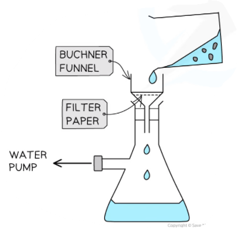

Core Practical 12: Preparing a Transition Metal Complex
-------------------------------------------------------

#### Method

1. Weigh between 1.4 g and 1.6 g of copper(II) sulfate.

   * To do this you should weigh a test tube and record its mass.
   * Then add the copper(II) sulfate to the test tube, reweigh and record the mass.
   * The mass of the copper(II) sulfate is the difference between the two masses.
2. Add 4 cm3 of water to the test tube using a graduated pipette.
3. Prepare a water bath using hot water from a kettle in a 100 cm3 beaker and stand the test tube in the water bath.
4. Stir gently to dissolve the copper(II) sulfate.
5. Remove the test tube containing copper(II) sulfate solution from the water bath.
6. <i>Perform this step in the fume cupboard wearing gloves</i>. Add, while stirring, 2 cm3 of concentrated ammonia solution to the copper(II) sulfate solution.
7. Pour the contents of the test tube into 6 cm3 of ethanol that has been pipetted into a beaker – mix well and then cool the mixture in an ice bath.
8. Using a Bϋchner funnel and flask, filter the crystals. Wash your test tube with cold ethanol and add the washings to the Bϋchner funnel. Finally, rinse the crystals with cold ethanol.
9. Carefully scrape the crystals off the filter paper onto a fresh piece of filter paper. Cover the crystals with a second piece of filter paper, Carefully pat the paper to dry the crystals. Note that to get the crystals completely dry, you may need to repeatedly move the crystals to dry parts of the filter paper.
10. Once dry, measure and record the mass of crystals

<i><b>Buchner filtration set-up to filter crystals</b></i>

#### Worked Example

A student measures a yield of 1.2 g of Cu(NH3)SO4·H2O after carrying out the method mentioned above

1. Write an equation for this reaction
2. Calculate the relative formula masses of CuSO4·5H2O and Cu(NH3)SO4·H2O
3. Calculate the number of moles of copper(II) sulfate used in the reaction
4. Use your answer to calculate the theoretical yield of tetraaminecopper(II) sulfate-1-water your reaction should have produced
5. Calculate the percentage yield obtained in this reaction
6. Comment on your percentage yield. Explain any loss or gain in mass compared with the theoretical yield

<b>Answers</b>

   1. CuSO4 + 4NH3 → Cu(NH3)4SO4•H2O +4H2O

Remember that as we have dissolved the copper sulfate in solution this is actually hydrated copper(II) sulfate CuSO4•5H2O = 249.5

   2. CuSO4•5H2O = 249.5               Cu(NH3)4SO4•H2O = 245.5

   3. 0.00601 moles (based on 1.5 g of CuSO4•5H2O)

<math><semantics><mrow><mi>moles</mi><mo> </mo><mo>=</mo><mo> </mo><mfrac><mrow><mn>1</mn><mo>.</mo><mn>5</mn></mrow><mrow><mn>249</mn><mo>.</mo><mn>5</mn></mrow></mfrac><mo>=</mo><mn>0</mn><mo>.</mo><mn>00601</mn><mo> </mo><mi>mol</mi></mrow><annotation>{"language":"en","fontFamily":"Times New Roman","fontSize":"18"}</annotation></semantics></math>

   4. Theoretical yield of Cu(NH3)4SO4•H2O = 1.48 g

As there is a molar ratio of 1:1 we know we will have 0.00481 moles of Cu(NH3)4SO4•H2O

The theoretical mass that we would expect to produce can then be calculated

<math><semantics><mrow><mi>mass</mi><mo> </mo><mo>=</mo><mo> </mo><mn>0</mn><mo>.</mo><mn>00601</mn><mo>×</mo><mn>245</mn><mo>.</mo><mn>5</mn><mo> </mo><mo>=</mo><mo> </mo><mn>1</mn><mo>.</mo><mn>48</mn><mo> </mo><mi>g</mi></mrow><annotation>{"language":"en","fontFamily":"Times New Roman","fontSize":"18"}</annotation></semantics></math>

   5. Percentage yield = <math><semantics><mrow><mfrac><mrow><mn>1</mn><mo>.</mo><mn>2</mn></mrow><mrow><mn>1</mn><mo>.</mo><mn>48</mn></mrow></mfrac><mo> </mo><mo>×</mo><mo> </mo><mn>100</mn><mo> </mo><mo>=</mo><mo> </mo><mn>81</mn><mo>%</mo></mrow><annotation>{"language":"en","fontFamily":"Times New Roman","fontSize":"18"}</annotation></semantics></math>

#### Safety

* Wear a lab coat and use eye protection.
* Tie long hair back.
* Concentrated ammonia solution is corrosive and dangerous to the environment. It must be kept  in the fume cupboard and handled wearing gloves.
* Copper salts are harmful and dangerous to the environment.
* Ethanol is flammable and must be kept away from flames.

#### Errors

* Losses could be from the reaction not going to completion and product staying in solution (i.e. not crystallising out)
* Gains could be from impure or wet crystals.